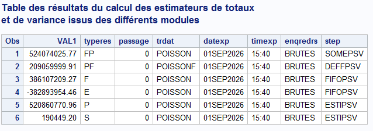
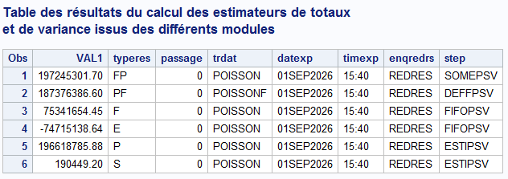
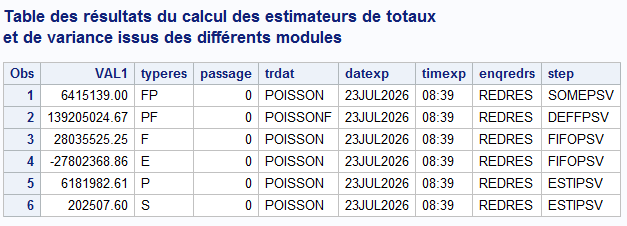
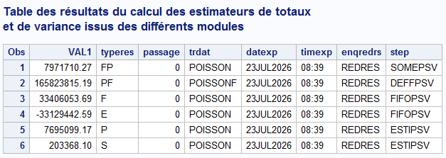
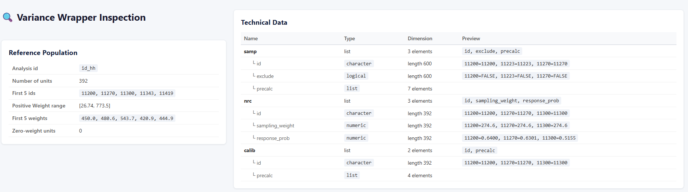
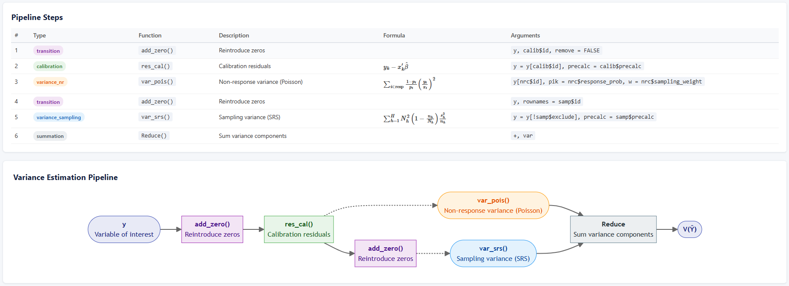

```{r setup, include=FALSE}
knitr::opts_chunk$set(
  echo = TRUE,
  message = TRUE,
  warning = TRUE,
  collapse = TRUE,
  comment = "#>",
  out.width = "100%",
  fig.align = "center"
)
```

# Introduction

This vignette documents the migration of variance estimation workflows
from the SAS `Poulpe` macro to R, using the `gustave` package developed
by INSEE. This vignette is intended for survey methodologists migrating
from the SAS Poulpe macro to R, or for methodologists who need to
implement analytical variance estimation for complex surveys.

The core outcome is a set of **variance estimation wrappers**:
self-contained R functions that encapsulate the full sampling
methodology (stratification, non-response correction, calibration,
multi-stage sampling) and can be distributed to thematic units. Once a
wrapper has been prepared by the methodologist, analysts can compute
precision measures on their own datasets with a single function call —
without needing to understand the underlying formulas. Wrappers can also
be called from Python through `rpy2`, allowing seamless integration into
existing analytical pipelines.

We have validated the R implementation against `Poulpe` reference values
across five progressively complex cases, from simple stratified sampling
to two-stage designs with individual-level estimation. The results
match, confirming that `gustave` fully replaces `Poulpe` for the survey
designs used at Statbel.

Beyond replication, this migration brings three practical benefits.
First, the variance functions are transparent and version-controlled,
making them auditable and reproducible. Second, custom `qvar`-like
functions standardise wrapper creation and reduce the risk of
methodological errors. Third, diagnostic tools and batch estimation
functions streamline quality reporting and production workflows.

The remainder of this vignette is structured as follows. Sections 2
through 6 present the five cases with their mathematical formulations, R
implementations, and `Poulpe` comparisons. Section 7 covers the
practical aspects of building production-ready wrappers. Section 8
concludes with limitations and outlook.

## Why variance estimation?

Survey estimates are based on a sample, not the full population. As
such, they are subject to **sampling variability**: a different sample
would yield different results. Variance estimation quantifies this
uncertainty, and is the foundation for computing confidence intervals,
coefficients of variation, and significance tests.

In practice, our surveys involve several layers of complexity beyond
simple random sampling: **stratification**, **non-response correction**
(through reweighting), and **calibration** on known population margins.
Each of these steps affects the variance, and ignoring them leads to
biased precision measures.

## The `gustave` package

[`gustave`](https://github.com/InseeFr/gustave) (a User-oriented
Statistical Toolkit for Analytical Variance Estimation) is an R package
developed by INSEE. It provides:

- Standard analytical variance estimators (Sen-Yates-Grundy,
  Deville-Tillé).
- A mechanism to produce **variance estimation wrappers**: user-friendly
  functions that encapsulate the full estimation methodology.
- Built-in handling of linearization (for means, ratios, etc.) and
  domain estimation.

`gustave` is the R successor to the `Poulpe` SAS macro, also developed
by INSEE and historically used at Statbel. Throughout this vignette, we
provide comparisons between the two tools to facilitate the transition.

## Structure of this vignette

We build up the variance estimation progressively, from the simplest to
the most complex case:

1.  **Stratified simple random sampling** (no non-response, no
    calibration)
2.  **Adding non-response** correction through reweighting
3.  **Adding calibration** on population margins
4.  **Two-stage sampling** with area then dwelling
5.  **Two-stage sampling** with area then dwelling, with individual
    answers

At each step, we introduce the relevant `gustave` functions and
concepts:

- `qvar()`: a quick, ready-to-use function for common survey designs.
- `define_variance_wrapper()`: the core function for defining custom
  variance estimation wrappers, necessary for more complex designs.
- The underlying variance functions: `var_srs()`, `var_pois()`,
  `res_cal()`, `add_zero()`.

We also introduce new functions developed in-house to help us to
operationalise the variance estimation :

- `inspect_wrapper()`: a function to run diagnostics on a variance
  wrapper, by extracting the reference population, the technical data
  inventory, and the variance estimation pipeline.
- `call_gustave()`: a function to call a `gustave` variance wrapper in a
  different way.
- `batch_gustave()`: a function to estimate variance across indicators,
  groups, and domains (like the legacy `boucle_poulpe`).

## Environment

```{r libraries_intern, include=FALSE}
library(tidyverse)
library(gt)
library(gustave)
devtools::load_all("Z:/E8/0632-BMCNEW/Github/gustave")
options(download.file.method="wininet")
library(extrapolation)

lfs_samp_area <- gustave::lfs_samp_area
lfs_samp_dwel <- gustave::lfs_samp_dwel
lfs_samp_ind  <- gustave::lfs_samp_ind
```

```{r sas_config, include=FALSE, eval = FALSE}
# Configuration of SASpy to transfert db
options(reticulate.conda_binary = 'C:/Users/Thomas.Delclite/AppData/Local/miniforge3/condabin/conda.bat')
sas <- sas::sas_create_session()
```

```{r libraries, eval = FALSE}
library(tidyverse)
library(gt)
library(gustave)

lfs_samp_area <- gustave::lfs_samp_area
lfs_samp_dwel <- gustave::lfs_samp_dwel
lfs_samp_ind  <- gustave::lfs_samp_ind
```

## Data

The vignette uses a simulated Labour Force Survey shipped with the `gustave` 
package: a two-stage design — areas are drawn as primary sampling units, 
dwellings within areas, and all individuals of a sampled dwelling are 
surveyed. The product of the two inclusion probabilities is constant 
across dwellings (`pik = pik_area * pik_dwel` $\approx 0.0083$), so 
that the one-stage weight `1/pik` matches the individual-level 
`sampling_weight`. There is no non-response into the data, we will create 
it later on purpose.

Key variables in the area sample (`lfs_samp_area`,
`r nrow(lfs_samp_area)` areas):

- `id_area`: area identifier (primary sampling unit)
- `income`: area-level income aggregate (illustrative; the estimations
  below use the dwelling- and individual-level incomes)
- `pik_area`: probability of selection of the area (between
  $`r round(min(lfs_samp_area$pik_area), 4)`$ and
  $`r round(max(lfs_samp_area$pik_area), 4)`$)
  
Key variables in the dwelling sample (`lfs_samp_dwel`,
`r nrow(lfs_samp_dwel)` dwellings in `r nrow(lfs_samp_area)` areas,
`r round(nrow(lfs_samp_dwel) / nrow(lfs_samp_area), 1)` dwellings per
area on average):

- `id_dwel`: dwelling identifier
- `id_area`: area identifier of the dwelling 
- `income`: dwelling income (between
  $`r round(min(lfs_samp_dwel$income), 1)`$ and
  $`r round(max(lfs_samp_dwel$income), 1)`$)
- `pik_area`: probability of selection of the area
- `pik_dwel`: probability of selection of the dwelling within its area
  (between $`r round(min(lfs_samp_dwel$pik_dwel), 3)`$ and
  $`r round(max(lfs_samp_dwel$pik_dwel), 3)`$
- `pik`: overall probability of selection of the dwelling
  (`pik_area * pik_dwel`, constant $\approx 0.0083$)

Key variables in the individual sample (`lfs_samp_ind`,
`r nrow(lfs_samp_ind)` individuals):

- `id_ind`: individual identifier
- `id_dwel`: dwelling identifier of the individual
  all individuals of a sampled dwelling are surveyed (exhaustive stage)
- `income`: individual income
- `unemp`: unemployment indicator
  (`r round(100 * base::mean(lfs_samp_ind$unemp), 1)` % of individuals)
- `sampling_weight`: overall sampling weight of the individual
  (`1/pik` of its dwelling, $\approx 120.24$)

The vignette preamble derives the following variables. For the sampling
design: `w_dwel_cond = 1/pik_dwel` (conditional dwelling weight,
$\approx 6$), `w_area = mean(1/pik_area)` (conditional area weight,
equalized across areas as the SRS convention requires,
$\approx `r round(base::mean(1 / lfs_samp_area$pik_area), 1)`$), and
`w_dwel = w_dwel_cond * w_area` (two-stage design weight,
$\approx 120$).

```{r}
lfs_samp_area$w_area       <- 1 / lfs_samp_area$pik_area
lfs_samp_area$w_area       <- base::mean(lfs_samp_area$w_area)
lfs_samp_dwel$w_dwel_cond  <- 1 / lfs_samp_dwel$pik_dwel
lfs_samp_dwel$w_dwel       <- lfs_samp_area$w_area * lfs_samp_dwel$w_dwel_cond
lfs_samp_dwel <- lfs_samp_dwel %>% select(-pik_area) %>% 
  left_join(lfs_samp_area %>% select(id_area,w_area), by = "id_area")
```

For the first three cases, we will consider only the dwelling level to
estimate the variance. Here we consider a stratified random sampling of
dwellings into population by area, and we only use the dwelling
answers, here the income for the example.

`gustave` needs a Boolean variable to indicate if the unit must be present 
for dissemination. Here all unit are used.

```{r}
lfs_samp_dwel$diss    <- TRUE
```

# Case 1: Stratified Simple Random Sampling

## Context

In this first case, we assume **full response** and **no calibration**.
We estimate the variance of the total income under a stratified simple
random sampling design of dwellings, where the strata are defined by
`id_area`.

This is the simplest case and allows us to understand the fundamental
mechanics of `gustave`.

## Variance decomposition

Before using `gustave`, let us verify the variance formula manually.
Under stratified SRS without replacement, the variance of the estimated
total $\hat{Y}$ is:

$$V(\hat{Y}) = \sum_{h=1}^{H} N_h^2 \left(1 - \frac{n_h}{N_h}\right) \frac{s_h^2}{n_h}$$

where $N_h$ and $n_h$ are the population and sample sizes in stratum
$h$, and $s_h^2$ is the sample variance within stratum $h$.

$$s_h^2 = \frac{1}{n_h - 1} \sum_{i \in h} \left(y_i - \bar y_h \right)^2$$

The variance estimate can be calculated manually in R:

```{r manual-variance}
lfs_samp_dwel %>%
  replace_na(list(income = 0)) %>%
  group_by(id_area) %>%
  mutate(
    N_h   = sum(w_dwel),
    n_h   = n(),
    y_bar = base::mean(income),
    dev2  = (income - y_bar)^2
  ) %>%
  summarise(
    N_h = base::mean(N_h),
    n_h = base::mean(n_h),
    s2  = sum(dev2) / (base::mean(n_h) - 1),
    .groups = "drop"
  ) %>%
  mutate(
    var_h = N_h^2 * (1 - n_h / N_h) * s2 / n_h
  ) %>%
  summarise(
    var_total = sum(var_h),
    se_total  = sqrt(sum(var_h))
  )
```

In `gustave`, this variance component is obtained with the function
`var_srs` : $\text{var\_srs}(y,\pi_i,\text{strata})$.

## Using `qvar()`

`qvar()` is the quick entry point into `gustave`. It handles the most
common survey designs in a single function call.

### Direct estimation

When called with a statistic (here `total(income)`), `qvar()` performs
the variance estimation directly:

```{r qvar-direct}
qvar(
  data = lfs_samp_dwel,
  id = "id_dwel",
  dissemination_dummy  = "diss",
  dissemination_weight = "w_dwel",
  sampling_weight = "w_dwel",
  strata = "id_area",
  total(income)
)
```

The key arguments are:

- `id`: the unit identifier (must be character).
- `dissemination_dummy`: a logical or 0/1 variable indicating which
  units are disseminated (here, all units).
- `dissemination_weight`: the final weight used for point estimation.
- `sampling_weight`: the initial design weight.
- `strata`: the stratification variable.

``qvar()` displays notes about the variance estimation process, recalling 
the survey design and the variable transformations it required. 
The output shows the estimated total (`est`), the estimated variance
(`var`), the standard error (`std`), the coefficient of variation
(`cv`), and the lower and upper bounds of a 95% confidence interval
(`lower` and `upper`).

### Defining a variance wrapper

When you need to estimate the variance for several variables, it is more
efficient to define a **variance wrapper** once and re-use it. This is
done by adding `define = TRUE` to `qvar()`:

```{r qvar-wrapper}
precision <- qvar(
  data = lfs_samp_dwel,
  id = "id_dwel",
  dissemination_dummy  = "diss",
  dissemination_weight = "w_dwel",
  sampling_weight = "w_dwel",
  strata = "id_area",
  define = TRUE
)
```

The resulting `precision` object is a function. It contains all the
methodological information and technical data needed for variance
estimation. The end user simply calls it with the dataset and the
statistic(s) of interest:

```{r qvar-wrapper-use}
# Variance of the total income
precision(lfs_samp_dwel, total(income))

# Several statistics at once, with labels
precision(lfs_samp_dwel,
  "Total income" = total(income),
  "Mean income"  = mean(income)
)

# Statistics with filter
precision(lfs_samp_dwel, mean(income), where = id_area == "A025")

# Statistics by groups
precision(lfs_samp_dwel, mean(income), by = id_area)
```

This is the core philosophy of `gustave`: the **methodologist** defines
the wrapper (once), and the **analyst** uses it (repeatedly) without
needing to understand the underlying variance estimation methodology.
The dataset used by the **analyst** needs only the id variable of
dwelling, everything else comes from the wrapper.

The wrapper can be saved as an `.rds` file and distributed to thematic
units. They only need to load the gustave package and the wrapper object
— from there, they can compute variance estimates on their own dataset.
The only constraint is that the identifier variable in their dataset
must match the one used when defining the wrapper.

```{r}
saveRDS(precision, file = "precision_dwel.rds")

rm(precision)

library(gustave)
precision <- readRDS(file="precision_dwel.rds")

# lfs_samp_dwel could be another dataset with other indicators
precision(lfs_samp_dwel, total(income))
```

## Using `define_variance_wrapper()`

`qvar()` covers the most common cases, but for complex survey designs
(multi-stage sampling, balanced sampling, custom non-response
corrections), we need the more flexible `define_variance_wrapper()`.

To use it, we must first write a **variance function**: an R function
that takes a matrix `y` of the variable of interest and returns the
estimated variance.

### Variance function

The variance function receives `y` as a named matrix (with row names
matching the unit identifiers) and accesses the technical data through
its enclosing environment.

For our stratified SRS case, we only need `var_srs()`:

```{r var-function-srs}
var_sample <- function(y, lfs_samp_dwel) {
  variance <- list()
  variance[["srs"]] <- var_srs(
    y,
    pik    = 1 / lfs_samp_dwel$w_dwel,
    strata = lfs_samp_dwel$id_area
  )
  Reduce(`+`, variance)
}
```

A few things to note:

- `lfs_samp_dwel` is not, here, the dwelling dataset. It is only a parameter
  for the function. We use the same name for convenience.
- `var_srs()` implements the variance estimator for stratified SRS.
- `pik` is the vector of first-order inclusion probabilities.
- We store variance components in a named list. This pattern will become
  useful later when we add more components (non-response, calibration).

### Defining the wrapper

To create the wrapper, we need to give technical data (here the dataset
with all information about the sampling and the dissemination weight).

```{r wrapper-srs}
technical_data <- list()
technical_data$lfs_samp_dwel <- lfs_samp_dwel

precision2 <- define_variance_wrapper(
  variance_function = var_sample,
  technical_data    = technical_data,
  reference_id      = technical_data$lfs_samp_dwel$id_dwel,
  reference_weight  = technical_data$lfs_samp_dwel$w_dwel,
  default_id        = "id_dwel"
)
```

The arguments are:

- `variance_function`: our custom variance function.
- `technical_data`: a list containing all auxiliary data needed by the
  variance function (sampling weights, strata, response probabilities,
  etc.). This data is embedded in the wrapper.
- `reference_id`: the vector of unit identifiers in the reference
  population (here, all sampled units).
- `reference_weight`: the dissemination weights for the reference
  population.
- `default_id`: the name of the identifier column in the dataset passed
  at estimation time.

### Using the wrapper

Using the wrapper is very easy, we only need to give it a dataset (with
a list of units indexed by the same id as the technical data). The
result should match `qvar()` exactly.

```{r wrapper-srs-use}
precision2(lfs_samp_dwel, total(income))

# Several statistics at once, with labels
precision2(lfs_samp_dwel,
  "Total income"  = total(income),
  "Mean income"   = mean(income)
)

# Statistics with filter
precision2(lfs_samp_dwel, mean(income), where = id_area == "A025")

# Statistics by groups
precision2(lfs_samp_dwel, mean(income), by = id_area)
```

# Case 2: Adding Non-Response

## Context

We now introduce **unit non-response**. In the simulated data,
approximately 60% of dwelling respond.

```{r}
set.seed(123)
lfs_samp_dwel$rand <- runif(nrow(lfs_samp_dwel))
lfs_samp_dwel$rep  <- lfs_samp_dwel$rand <= 0.6
lfs_samp_dwel$prep <- 0.6
```

Non-response is corrected by **reweighting**: the weights of respondents
are adjusted to compensate for the non-respondents. Here, we use the constant
probability of non-response. In practice, the probability of
response is estimated by a logistic model. Be careful: use 0 instead of 
missing values for non-response weight. In these calculations, missing 
values create some trouble.

```{r}
lfs_samp_dwel$w_dwel_cond_nrc <- lfs_samp_dwel$w_dwel_cond / lfs_samp_dwel$prep
lfs_samp_dwel$w_dwel_nrc      <- lfs_samp_dwel$w_dwel      / lfs_samp_dwel$prep

lfs_samp_dwel$w_dwel_cond_nrc[!lfs_samp_dwel$rep] <- 0
lfs_samp_dwel$w_dwel_nrc[!lfs_samp_dwel$rep] <- 0
lfs_samp_dwel$income[!lfs_samp_dwel$rep]  <- 0
```

```{r transfert_sas_case2, include = FALSE, eval = FALSE}
sas$saslib('CMC', path="F:\\Dwh\\1. General\\1.4 Methodology\\1.4.4. CMC Share\\Migration from SAS to R")
lfs_samp_dwel_sas <- lfs_samp_dwel %>% 
  mutate(across(is.logical,as.numeric))
sas$df2sd(lfs_samp_dwel_sas,"lfs_samp_dwel","CMC")
```

## Variance decomposition

When non-response is treated as a second phase of (Poisson) sampling,
the total variance decomposes into two additive components (Caron, 1998):

$$V(\hat{Y}) = V_{\text{sampling}} + V_{\text{non-response}}$$

$V_{\text{sampling}}$ is estimated using `var_srs()` on the full sample
(respondents and non-respondents). Before computing the sampling
variance, the variable of interest is divided by the response
probability $p_i$, so that the sampling variance operates on the
non-response-corrected variable. Non-respondents are reintroduced with
zero values via `add_zero()`.

$$V_{\text{sampling}} = \sum_{h=1}^{H} N_h^2 \left(1 - \frac{n_h}{N_h}\right) \frac{s_h^2}{n_h}$$

where the sample variance within stratum $h$ is computed on the
corrected variable:

$$s_h^2 = \frac{1}{n_h - 1} \sum_{i \in h} \left(\frac{y_i}{p_i} - \bar y_h \right)^2$$

For non-respondents, $y_i = 0$, so they contribute to the variance
through the deviation from the stratum mean.

$V_{\text{non-response}}$ is estimated using `var_pois()` on respondents
only. It captures the additional variability introduced by the random
nature of non-response:

$$V_{\text{non-response}} = \sum_{i \in \text{resp}}{ \frac{1}{\pi_i} (1-p_i) \left(\frac{y_i}{p_i}\right)^2}$$

where $\pi_i = n_h / N_h$ is the inclusion probability of unit $i$ in
stratum $h$, and $p_i$ is the estimated response probability. In
practice, $p_i$ is estimated through logistic regression or within
homogeneous response groups.

In `gustave`, this variance component is obtained with
$var\_pois(y, pik = p_i, w = 1/\pi_i)$ where `pik` receives the response
probabilities and `w` receives the sampling weights.

## Using `qvar()`

`qvar()` integrates the non-response with two new parameters:

```{r qvar-nrc}
precision_nrc <- qvar(
  data                 = lfs_samp_dwel,
  id                   = "id_dwel",
  strata               = "id_area",
  dissemination_dummy  = "rep",
  dissemination_weight = "w_dwel_nrc",
  sampling_weight      = "w_dwel",
  nrc_weight           = "w_dwel_nrc",
  response_dummy       = "rep",
  define = TRUE
)

precision_nrc(lfs_samp_dwel, total(income))
```

Note the new arguments:

- `dissemination_dummy` now refers to `rep` (only respondents are
  disseminated).
- `nrc_weight`: the weight after non-response correction.
- `response_dummy`: indicates respondents.

Here we pass the whole `lfs_samp_dwel` dataset to the wrapper. `gustave`
informs us that some units are discarded because of non-response. The
result is the same with the subset of the dataset.

```{r}
precision_nrc(lfs_samp_dwel %>% filter(rep == 1), total(income))
```

## Using `define_variance_wrapper()`

### Variance function

The variance function now has two components: `var_pois` and `var_srs`.
We also add some calculations for `Poulpe` comparison. We discuss them
later.

```{r var-function-nrc}
diag_env <- new.env(parent = emptyenv())
var_sample_nrc <- function(y, lfs_samp_dwel) {
  
  variance <- list()

  resp <- lfs_samp_dwel %>% filter(rep == 1)
  
  # Component 1: Non-response variance (Poisson, respondents only)
  variance[["nr"]] <- var_pois(
    y[resp$id_dwel, ,drop = FALSE],
    pik = resp$prep,
    w   = resp$w_dwel
  )
  
  # Poulpe calculations
  poulpe_F <- var_pois(
    y[resp$id_dwel, ,drop = FALSE] * resp$w_dwel,
    pik = resp$prep
  )
  
  # Reintroduce non-respondents with zeros
  y <- add_zero(y, rownames = lfs_samp_dwel$id_dwel)
  
  # Component 2: Sampling variance (SRS, full sample)
  # The variable must be divided by the response probability
  variance[["srs"]] <- var_srs(
    y / (lfs_samp_dwel$w_dwel / lfs_samp_dwel$w_dwel_nrc),
    pik    = 1 / lfs_samp_dwel$w_dwel,
    strata = lfs_samp_dwel$id_area
  )
  
  diag_env$components <- variance
  diag_env$poulpe <- tibble(typeres="FP",value=Reduce(`+`, variance)) %>%
    add_row(typeres="PF",value=NA) %>% 
    add_row(typeres="F",value=poulpe_F) %>% 
    add_row(typeres="E",value=variance[["nr"]] - poulpe_F) %>% 
    add_row(typeres="P",value=variance[["srs"]]) %>% 
    add_row(typeres="S",value=NA) 
  
  Reduce(`+`, variance)
}
```

`var_pois()` estimates the variance under Poisson sampling. It requires:

- `y`: the variable of interest (respondents only).
- `pik`: the response probabilities (estimated by
  $w_{\text{smp}} / w_{\text{nrc}}$).
- `w`: an optional weight vector (the sampling weight, to account for
  the first sampling stage).
- `drop = FALSE`: this option ensure that the row names indexation is
  kept during the subset

`add_zero()` is a key utility: it reintroduces the non-responding units
into the `y` matrix by adding rows of zeros. This is necessary because
`var_srs()` operates on the full sample.

A crucial point: the order matters.

1.  **First**, estimate the non-response variance on respondents only.
2.  **Then**, use `add_zero()` to expand `y` back to the full sample.
3.  **Finally**, estimate the sampling variance on the full sample,
    after dividing by the response probability.

This ordering mirrors the mathematical decomposition: we work "inside
out", from the last correction step back to the first sampling step.

### Technical data and wrapper creation

The creation of the wrapper is almost the same as for the case 1, except
for some considerations about weights.

```{r wrapper-nrc}
technical_data_nrc <- list()
technical_data_nrc$lfs_samp_dwel <- lfs_samp_dwel

precision2_nrc <- define_variance_wrapper(
  variance_function = var_sample_nrc,
  technical_data    = technical_data_nrc,
  reference_id      = technical_data_nrc$lfs_samp_dwel$id_dwel,
  reference_weight  = technical_data_nrc$lfs_samp_dwel$w_dwel_nrc,
  default_id        = "id_dwel"
)
```

**Important notes:**

- The `reference_weight` must be the **dissemination weight** (`wNrc`),
  not the sampling weight. Non-respondents have weight 0.
- NA values in `wNrc` must be replaced by 0 in `technical_data` before
  defining the wrapper.

### Using the wrapper

When we use the wrapper, the data is automatically filtered to keep only 
responding units. A warning is shown to inform you. If the unit identifiers 
are ordered differently in the technical data and in the estimation data, 
`gustave` tells you that the rows have been reordered. This should has no 
impact on the variance estimation.

```{r}
precision2_nrc(lfs_samp_dwel, total(income))
precision2_nrc(lfs_samp_dwel %>% filter(rep == 1), total(income))
```

Here we expect a higher variance in this case 2.

```{r}
precision2(lfs_samp_dwel, total(income))
(results <- precision2_nrc(lfs_samp_dwel, total(income)))
```

## Comparison with `Poulpe`

```{r eval=FALSE, include=FALSE}
options(reticulate.conda_binary = 'C:/Users/Thomas.Delclite/AppData/Local/miniforge3/condabin/conda.bat')
sas <- sas::sas_create_session()
sas$submit("libname CMC 'F:\\Dwh\\1. General\\1.4 Methodology\\1.4.4. CMC Share\\Migration from SAS to R';")
lfs_samp_dwel_sas <- lfs_samp_dwel %>% 
  mutate(diss = as.numeric(diss),
         rep = as.numeric(rep))
sas$df2sd(lfs_samp_dwel_sas,"lfs_samp_dwel","CMC")
```

In our variance function, we reproduce all the calculation steps from
`Poulpe` to compare with it. Here is the output from `Poulpe` :

```{r echo=FALSE, out.width="90%"}

```

In `Poulpe`, the non-response variance component is not displayed
directly. Instead, `Poulpe` outputs two intermediate quantities, F and
E, whose difference yields the non-response variance (see Caron, 1998, p.
185). Understanding the relationship between these quantities and the
`gustave` formulation requires examining how the Poisson variance
formula is parameterised.

```{r echo=FALSE}
tibble(
  Component = c("Point estimate","Sampling variance",
                "F-Non-response component","E-Non-response component",
                "Non-response variance","Total variance"),
  typeres = c("S","P","F","E","E+F","FP"),
  gustave = c("est","`var_srs()` component","","","`var_pois()` component","var")
  ) %>% 
  left_join(diag_env$poulpe, by = "typeres") %>% 
  mutate(value = case_when(
    typeres == "S"   ~ results$est,
    typeres == "E+F" ~ diag_env$components$nr,
    TRUE ~ value
  )) %>% 
  gt(caption = "Variance elements for Poulpe calculated from gustave")
```

The F component in Poulpe corresponds to a Poisson variance where the
sampling weight has been absorbed into the variable of interest (i.e.,
the formula operates on $y_i / (\pi_i p_i)$ rather than on $y_i$ with a
separate weight argument):

$$V_{\text{F-poulpe}} = \sum_{i\in \text{resp}}{(1-p_i) \left(\frac{y_i}{p_i\pi_i}\right)^2}$$

This is obtained in gustave by passing the pre-weighted variable to
`var_pois()`: `var_pois(y / pik_i, pik = p_i)`.

The `gustave` non-response variance, by contrast, keeps the sampling
weight separate through the `w` argument:

$$V_{\text{NR}} = \sum_{i\in \text{resp}}{ \frac{1}{\pi_i} (1-p_i) \left(\frac{y_i}{p_i}\right)^2}$$

The difference between these two expressions is the E component:

$$V_{\text{E-poulpe}} = V_{\text{NR}} - V_{\text{F-poulpe}} = \sum_{i\in \text{resp}}{(1-p_i) \left(\frac{y_i}{p_i}\right)^2 \left(\frac{1}{\pi_i} - \frac{1}{\pi_i^2}\right)}$$

The E-part of the Poulpe calculation is negative and can be obtained by 
setting $\text{var\_pois}(y_i,p_i,1/\pi - 1/\pi^2)$. This component is not 
a variance in itself, it is an intermediate result. The meaningful
quantity is always $E + F$, which equals the `gustave` non-response
component. In practice, verifying that the `gustave` total variance (FP)
matches the `Poulpe` output is sufficient; the F and E components are
useful for debugging but carry no independent methodological
interpretation.

# Case 3: Adding Calibration

## Context

Here we account for **calibration** in the variance estimation. After
non-response correction, the weights are typically calibrated on known
population margins (e.g., totals by region, by sex, by age group) to
reduce bias and improve precision.

Calibration reduces the variance of the estimator: by forcing the
weighted sample to reproduce known population totals, it removes part of
the variability.

## Variance decomposition

There is no major change in the formula of variance estimation, we just
need to replace the variable of interest `y` with **calibration
residuals** before computing the variance components. These calibration
residuals are obtained as the residuals of a weighted linear regression
of `y` on the calibration variables `x`:

$$e_k = y_k - x_k' \hat{\beta}, \quad \text{where} \quad \hat{\beta} = (X'WX)^{-1} X'Wy$$

These residuals capture the part of `y` that is not explained by the
calibration variables, which is the only part that contributes to the
variance.

```{r rescal-example, eval=T}
resp_dwel <- lfs_samp_dwel %>% filter(rep == 1)

# Example: if calibrating on id_area (catégorical)
e <- res_cal(resp_dwel$income, x = model.matrix(~ id_area, data = resp_dwel))
```

**Important:** `res_cal()` by default performs the regression **without
an intercept**. The example above uses `model.matrix()` (intercept + 
treatment contrasts) instead. In `qvar()`, Qualitative calibration 
variables (character or factor) are automatically discretized into 
full sets of dummies.

For all the following cases, we assume the weights have already been
calibrated on the variable `id_area`.

## Using `qvar()`

```{r qvar-cal}
lfs_samp_dwel <- as.data.frame(lfs_samp_dwel)

precision_cal <- qvar(
  data                 = lfs_samp_dwel,
  id                   = "id_dwel",
  strata               = "id_area",
  dissemination_dummy  = "rep",
  dissemination_weight = "w_dwel_nrc",
  sampling_weight      = "w_dwel",
  nrc_weight           = "w_dwel_nrc",
  response_dummy       = "rep",
  calibration_dummy    = "rep",
  calibration_weight   = "w_dwel_nrc",
  calibration_var      = "id_area",
  define = TRUE
)

precision_cal(lfs_samp_dwel, total(income))
```

New arguments:

- `calibration_dummy`: which units were used in the calibration
  (typically, the respondents).
- `calibration_weight`: the calibrated weight.
- `calibration_var`: the calibration variable(s). For categorical
  variables, `qvar()` automatically creates the dummy matrix.

**Note:** `qvar()` does not accept tibbles when calibration variables
are specified. Convert to `data.frame` first.

## Using `define_variance_wrapper()`

### Variance function

The variance function now includes a `res_cal()` step before the
variance components:

```{r var-function-cal}
diag_env <- new.env(parent = emptyenv())

var_sample_cal <- function(y, lfs_samp_dwel) {
  
  variance <- list()

  resp <- lfs_samp_dwel %>% filter(rep == 1)
  
  # Step 0: Prepare the calibration matrix (respondents only)
  cal_form <- as.formula("~id_area")
  x_cal <- model.matrix(cal_form, data = resp)

  # Step 1: Replace y with calibration residuals (respondents only)
  y[resp$id_dwel, ] <- res_cal(
    y[resp$id_dwel, ,drop = FALSE],
    x = x_cal,
    w = resp$w_dwel_nrc
  )
  
  # Step 2: Non-response variance (Poisson, respondents only)
  variance[["nr"]] <- var_pois(
    y[resp$id_dwel, ,drop = FALSE],
    pik = resp$prep,
    w   = resp$w_dwel
  )
  
  poulpe_F <- var_pois(
    y[resp$id_dwel, ,drop = FALSE] * resp$w_dwel,
    pik = resp$prep
  )
  
  # Step 3: Reintroduce non-respondents with zeros
  y <- add_zero(y, rownames = lfs_samp_dwel$id_dwel)
  
  # Step 4: Sampling variance (SRS, full sample)
  variance[["srs"]] <- var_srs(
    y / (lfs_samp_dwel$prep),
    pik    = 1 / lfs_samp_dwel$w_dwel,
    strata = lfs_samp_dwel$id_area
  )
  
  diag_env$components <- variance
  diag_env$poulpe <- tibble(typeres="FP",value=Reduce(`+`, variance)) %>%
    add_row(typeres="PF",value=NA) %>% 
    add_row(typeres="F",value=poulpe_F) %>% 
    add_row(typeres="E",value=variance[["nr"]] - poulpe_F) %>% 
    add_row(typeres="P",value=variance[["srs"]]) %>% 
    add_row(typeres="S",value=NA) 
  
  Reduce(`+`, variance)
}
```

The key addition is **Step 1**: before any variance computation, we
replace `y` with its calibration residuals. This reduces the variance
because the part of `y` explained by the calibration variables is
removed.

Here, we have hardcoded the calibration variables in the variance function 
itself. In practice, it is better to dynamically build the calibration 
matrix from all variables in `lfs_samp_dwel` used in the calibration model. 
We will see in the Practical Implementation section how to make the 
calibration variables fully configurable through the `technical_data` and 
`technical_param` mechanism, so that the same variance function can 
accommodate different calibration specifications without modifying its 
source code.

### Technical data and wrapper creation

The creation of the wrapper is unchanged.

```{r wrapper-cal}
technical_data_cal <- list()
technical_data_cal$lfs_samp_dwel <- lfs_samp_dwel

precision2_cal <- define_variance_wrapper(
  variance_function = var_sample_cal,
  technical_data    = technical_data_cal,
  reference_id      = technical_data_cal$lfs_samp_dwel$id_dwel,
  reference_weight  = technical_data_cal$lfs_samp_dwel$w_dwel_nrc,
  default_id        = "id_dwel"
)
```

### Using the wrapper

We expect a lower variance estimation with calibration step.

```{r}
precision2(lfs_samp_dwel, total(income))
precision_nrc(lfs_samp_dwel, total(income))
(results <- precision2_cal(lfs_samp_dwel, total(income)))
```

## Comparison with `Poulpe`

Here is the variance calculated by `Poulpe` :

```{r echo=FALSE, out.width = "90%"}

```

```{r echo=FALSE}
tibble(
  Component = c("Point estimate","Sampling variance",
                "F-Non-response component","E-Non-response component",
                "Non-response variance","?","Total variance"),
  typeres = c("S","P","F","E","E+F","PF","FP"),
  gustave = c("est","`var_srs()` component","","",
              "`var_pois()` component","?","var")
  ) %>% 
  left_join(diag_env$poulpe, by = "typeres") %>% 
  mutate(value = case_when(
    typeres == "S"   ~ results$est,
    typeres == "E+F" ~ diag_env$components$nr,
    TRUE ~ value
  )) %>% 
  gt(caption = "Variance elements for Poulpe calculated from gustave")
```

# Case 4: Two-Stage Sampling

## Context

In many dwelling surveys at Statbel (such as LFS), the sampling design
involves two stages. First, a random sample of municipalities is
drawn from the population. Then a stratified random sample of dwellings 
is drawn. Some of them do not respond, and answers are at dwelling level. 
At last, weights are corrected through reweighting.

## Variance decomposition

This two-stage design introduces an additional source of variability
compared to the previous cases. The total variance now decomposes into
three additive components:

$$V(\hat{Y})=V_{PSU}+V_{HH}+V_{NR}$$

The first component captures the uncertainty from drawing PSUs from the
population. The second captures the uncertainty from drawing dwellings
from the selected PSU. The last component accounts for the random nature
of dwelling non-response.

Let us define the following quantities. At the PSU level: $N_P$ is the
total number of PSUs in the population, $n_P$ is the number of sampled PSUs, 
and $\pi_{\text{psu}}$ is the first-order inclusion probability of a PSU. At
the dwelling level: $N_{h|j}$ is the number of dwellings in PSU $j$ for the 
strata $h$, $n_{h|j}$ is the number of sampled dwellings in PSU $j$ for the 
strata $h$, and $\pi_{h|j}$ is the conditional inclusion probability of 
dwelling $h$ given that PSU $j$ and strata $h$ has been selected. 
The overall inclusion probability of a dwelling is
$\pi_h = \pi_{\text{psu}(h)} \cdot \pi_{h|\text{psu}(h)}$. Finally,
$p_h$ denotes the estimated response probability for dwelling $h$.

Non-response is modeled as a Poisson sampling phase. For each responding
dwelling, the contribution to the non-response variance depends on its
response probability and its fully expanded value. The formula is:

$$V_{\text{NR}} = \sum_{i\in \text{resp}}{ \frac{1}{\pi_i} (1-p_i) \left(\frac{y_i}{p_i}\right)^2}$$


Within each selected PSU, a simple random sample of dwellings is drawn.
The sub-sampling variance is the sum, across all sampled PSUs, of the
within-PSU SRS variance, each weighted by the inverse of the PSU
inclusion probability to account for the fact that only a fraction of
the PSUs are observed:

$$V_{HH} = \sum_{j=1}^{n_P}{\frac{1}{\pi_{\text{psu},j}} \left[ \sum_{h=1}^{H} N_{h|j}^2 \left(1 - \frac{n_{h|j}}{N_{h|j}}\right) \frac{s_{h|j}^2}{n_{h|j}} \right]}$$

where $s_{h|j}^2$ is the sample variance of the non-response-corrected
variable $y_h / p_h$ within PSU $j$. In the R code, this is implemented
by looping over PSUs and calling `var_srs()` on each subset, then
multiplying by $1/\pi_{\text{psu}}$.

Before computing the PSU-level variance, the dwelling-level variable
must be aggregated to PSU totals. For each PSU $j$, the estimated PSU
total is obtained by expanding the non-response-corrected dwelling
values using the within-PSU Horvitz-Thompson estimator:

$$\hat Y_{j} = \sum_{h\in j} \frac{1}{\pi_{h|j}}\frac{y_{h}}{p_h}$$

In `gustave`, this aggregation is performed by `sum_by()` with the
weight argument set to $1/{\pi_{h|j}}$.

Once the PSU-level totals $\hat Y_{j}$ are available, the PSU sampling
variance follows the standard stratified SRS formula:

$$V_{PSU} = N_{P}^2 \left( 1 - \frac{n_{P}}{N_{P}} \right)\frac{s^2_{P}}{n_{P}}$$

Where $s^2_{P}$ is the sample variance of the $\hat Y_{j}$ values. 
In `gustave`, this is a single call to `var_srs()`.

This case cannot be handled by `qvar()`, which is limited to
single-stage designs. It is precisely the kind of situation where
`define_variance_wrapper()` becomes essential: we need to write a custom
variance function that chains the three components in the correct order
— from the innermost stage (dwelling sub-sampling) back to the
outermost stage (PSU sampling), applying `add_zero()` at each transition
to reintroduce the units lost at the previous step.

We explain step by step the `define_variance_wrapper()` writing, then we
introduce a custom `qvar_ms()` function, to estimate variance for 
multi-levels stratified simple random sampling.

For this case, we use the two datasets `lfs_samp_area` and `lfs_samp_dwel`.

## Using `define_variance_wrapper()`

### Variance function

```{r var-function-two}
diag_env <- new.env(parent = emptyenv())
var_sample_two <- function(y, lfs_samp_area, lfs_samp_dwel) {
  
  variance <- list()

  # Step 0: Prepare the respondents datasets
  resp_dwel <- lfs_samp_dwel %>% filter(rep == 1)
  
  # Step 1: Prepare the calibration matrix (individual level)
  cal_form <- as.formula("~id_area")
  x_cal <- model.matrix(cal_form, data = resp_dwel)

  # Step 2: Replace y with calibration residuals
  y[resp_dwel$id_dwel, ] <- res_cal(
    y[resp_dwel$id_dwel,],
    x = x_cal,
    w = resp_dwel$w_dwel_nrc
  )
  
  # Step 3: Non-response variance (Poisson, individuals respondents only)
  variance[["nr"]] <- var_pois(
    y[resp_dwel$id_dwel, ,drop = FALSE],
    pik = resp_dwel$prep,
    w = resp_dwel$w_dwel
  )
  
  poulpe_F <- var_pois(
    y[resp_dwel$id_dwel, ,drop = FALSE] * resp_dwel$w_dwel,
    pik = resp_dwel$prep
  )
  
  # Step 4: Reintroduce dwellings non-respondents with zeros
  y <- add_zero(y, rownames = lfs_samp_dwel$id_dwel)
  
  # Step 5: One variance per PSU, weighted by PSU size
  variance[["srs-dwel"]] <- unique(lfs_samp_dwel$id_area) %>% map(~{
    sub <- lfs_samp_dwel %>% filter(id_area == .x)
    pik_area <- 1 / unique(sub$w_area)
    var_srs(
      y[sub$id_dwel, ,drop = FALSE] / sub$prep,
      pik    = 1 / sub$w_dwel_cond
    ) * 1/pik_area
  }) %>% unlist %>% sum
  
  # --- Transition: aggregate to area level ---
  y_area <- sum_by(y / lfs_samp_dwel$prep, 
                   by = lfs_samp_dwel$id_area, 
                   w = lfs_samp_dwel$w_dwel)
  
  # Step 6: area sampling variance
  variance[["srs-area"]] <- var_srs(
    y_area[lfs_samp_area$id_area, , drop = FALSE],
    pik    = 1 / lfs_samp_area$w_area
  )
  
  diag_env$components <- variance
  diag_env$poulpe <- tibble(typeres="FP",value=Reduce(`+`, variance)) %>%
    add_row(typeres="PF",value=NA) %>% 
    add_row(typeres="F",value=poulpe_F) %>% 
    add_row(typeres="E",value=variance[["nr"]] - poulpe_F) %>% 
    add_row(typeres="P",value=variance[["srs-dwel"]] + variance[["srs-area"]]) %>% 
    add_row(typeres="S",value=NA)
  
  Reduce(`+`, variance)
}
```

The key addition is two aggregations, one at dwelling then at area
level. The calibration is done at individual level. There are two
`var_srs()` steps, the key step here is to estimate variance of
dwelling within each area, and then to divide by the selection
probability of each area After that, we aggregate from dwelling to area
with the non-response correction and finally calculate the variance due
to the area sampling.

### Technical data and Wrapper

```{r wrapper-two}
technical_data_two <- list()
technical_data_two$lfs_samp_area <- lfs_samp_area
technical_data_two$lfs_samp_dwel  <- lfs_samp_dwel

precision_two <- define_variance_wrapper(
  variance_function = var_sample_two,
  technical_data    = technical_data_two,
  reference_id      = technical_data_two$lfs_samp_dwel$id_dwel,
  reference_weight  = technical_data_two$lfs_samp_dwel$w_dwel_nrc,
  default_id        = "id_dwel"
)
```

### Using the Wrapper

```{r}
(results <- precision_two(lfs_samp_dwel %>% filter(rep == 1), total(income)))
```

## Using `qvar_ms()`

`qvar_ms()` extends `qvar()` to multistage sampling designs, that is:
stratified simple random sampling at each stage (units of stage k being
drawn within the units of stage k - 1) ; non-response correction (if
any) through reweighting, possibly at each stage ; calibration (if any)
at one given stage.

To use `qvar_ms()`, you need, at each stage of sampling, the conditional
sampling weight, the probability of response (if any) and the
calibration weight (if any). Parameters are quite identical as `qvar()`,
except you need list to declare argument for each stage.

```{r}
precision2_two <- qvar_ms(
  
  # One file per stage, from the highest to the lowest
  data = list(lfs_samp_area, lfs_samp_dwel),
  sampling_stages = 2,
  id = c("id_area", "id_dwel"),
  parent_id = "id_area",
  
  # Dissemination and scope (last stage only)
  dissemination_dummy = "rep",
  dissemination_weight = "w_dwel_nrc",
  
  # Sampling design (conditional weights)
  sampling_weight = c("w_area", "w_dwel_cond"),
  
  # Non-response correction (last stage by default)
  response_prob = "prep",
  response_dummy = "rep",

  # Calibration (last stage by default, cumulated weight)
  calibration_weight = "w_dwel_nrc",
  calibration_var = "id_area",
  
  define = TRUE
)

precision2_two(lfs_samp_dwel,total(income))
```

## Comparison with `Poulpe`

```{r eval=FALSE, include=FALSE}
sas$df2sd(lfs_samp_area,"lfs_samp_area","CMC")
```

Here is the variance calculated by `Poulpe` :

```{r echo=FALSE, out.width = "90%"}

```

```{r echo=FALSE}
tibble(
  Component = c("Point estimate","Sampling variance",
                "F-Non-response component","E-Non-response component",
                "Non-response variance","?","Total variance"),
  typeres = c("S","P","F","E","E+F","PF","FP"),
  gustave = c("est","`var_srs()` component","","",
              "`var_pois()` component","?","var")
  ) %>% 
  left_join(diag_env$poulpe, by = "typeres") %>% 
  mutate(value = case_when(
    typeres == "S"   ~ results$est,
    typeres == "E+F" ~ diag_env$components$nr,
    TRUE ~ value
  )) %>% 
  gt(caption = "Variance elements for Poulpe calculated from gustave")
```

# Case 5: Adding individuals answers

## Context

Case 4 assumed that the variable of interest was measured at the
dwelling level. In practice, however, most survey statistics are
produced at the individual level — for instance, unemployment rates or
average income per person. In this case, the sampling design remains a
two-stage draw (area sampling, then dwelling SRS within areas), 
followed by an exhaustive collection of all individuals within
responding dwellings. The third sampling stage is exhaustive : once a
dwelling responds, all its members are observed.

Once again, `qvar()` cannot estimate variance for a three-stage sampling
design. We need to develop a variance wrapper by ourself. `qvar_ms()` 
integrate natively this case. As we see in this section, the introduction 
of the individual ask some questions about which stage the non-response 
and the calibration occur. We explain the consequences of each choice, 
present the choice made by `Poulpe` and how to use `qvar_ms()` here.

## Variance decomposition

The total variance still decomposes into the same three additive
components as in Case 4:

$$V(\hat{Y})=V_{PSU}+V_{HH}+V_{NR}$$

The formulas are identical to those presented in Case 4. The only
difference is operational: the variable of interest $y_i$ is now defined
at the individual level and must be aggregated to the dwelling level
(by summing within dwellings) before computing the dwelling and area
variance components. This aggregation step occurs naturally through
`sum_by()`.

### Non-response level: dwelling or individual?

A subtle but important question arises: at which level should
non-response be modeled? In reality, non-response occurs at the
dwelling level — when a dwelling refuses to participate, all its
members are lost simultaneously. However, in the `Poulpe` methodology,
non-response is always treated as the last phase of the sampling design,
which means it is applied at the level of the analysis unit — here, the
individual.

These two approaches lead to different variance estimates because they
imply different models for the non-response mechanism. When non-response
is modeled at the dwelling level, the response probability $p_h$ is the
same for all members of dwelling $h$, and the non-response variance is
computed on dwelling-level aggregates. When non-response is modeled at
the individual level, each individual carries the response probability
of their dwelling, but the Poisson variance formula is applied to
individual-level values — which implicitly treats each individual as an
independent response unit.

We implement both approaches below. The first version
(`var_sample_three_1()`) models non-response at the individual level,
consistent with the `Poulpe` convention. The second version
(`var_sample_three_2()`) models non-response at the dwelling level,
which better reflects the actual data-generating process. Comparing the
two helps assess the sensitivity of the variance estimate to this
modelling choice and validates the R implementation against `Poulpe`
reference values.

### Calibration level

The level at which calibration residuals are computed depends on the
non-response modelling choice.

In the `Poulpe`-consistent approach (version 1), calibration is applied
at the individual level before any aggregation. The calibration matrix
contains individual-level variables alongside dwelling-level variables 
that are simply repeated for each dwelling member. This is consistent 
with `Poulpe`'s convention of applying a single `res_cal()` at the 
analysis unit level.

In the dwelling-level approach (version 2), the individual variable of
interest is first aggregated to the dwelling level. Calibration is then
applied at the dwelling level. If the actual calibration used both
dwelling margins and individual margins, the individual calibration 
variables must be aggregated to the dwelling level — typically by 
summing the dummy indicators within each dwelling — before being 
included in the `res_cal()` calibration matrix. This produces a 
dwelling-level residual that accounts for both types of margins 
simultaneously.

For this case, we use the three datasets `lfs_samp_area`, `lfs_samp_dwel` and
`lfs_samp_ind`. We need to make some changes to the datasets before using
them. In particular, we copy the `pik_dwel` into the individual dataset.

```{r}
lfs_samp_ind <- lfs_samp_ind %>% 
  select(-any_of(c("pik_area","w_area","w_dwel_nrc","w_dwel_cond",
                   "prep","rep","id_area"))) %>% 
  left_join(lfs_samp_dwel %>% 
              select(id_dwel,id_area,rep,prep,w_dwel_nrc,
                     w_dwel_cond),by = "id_dwel") %>% 
  left_join(lfs_samp_area %>% 
              select(id_area,pik_area,w_area),by = "id_area")
```

## Using `define_variance_wrapper()`

### Variance function

In `var_sample_three_1()`, `res_cal()` and `var_pois()` are done before
dwelling aggregation.

```{r var-function-three}
diag_env_1 <- new.env(parent = emptyenv())
var_sample_three_1 <- function(y, lfs_samp_area, lfs_samp_dwel, lfs_samp_ind) {
  
  variance <- list()
  poulpe <- list()

  # Step 0: Prepare the respondents datasets
  resp_ind  <- lfs_samp_ind %>% filter(rep == 1)
  resp_dwel <- lfs_samp_dwel %>% filter(rep == 1)
  
  # Step 1: Prepare the calibration matrix (individual level)
  cal_form <- as.formula("~id_area")
  x_cal <- model.matrix(cal_form, data = resp_ind)

  # Step 2: Replace y with calibration residuals
  y[resp_ind$id_ind, ] <- res_cal(
    y[resp_ind$id_ind,],
    x = x_cal,
    w = resp_ind$w_dwel_nrc
  )
  
  # Step 3: Non-response variance (Poisson, individuals respondents only)
  variance[["nr"]] <- var_pois(
    y[resp_ind$id_ind, ,drop = FALSE],
    pik = resp_ind$prep,
    w = resp_ind$w_area * resp_ind$w_dwel_cond
  )
  
  poulpe_F <- var_pois(
    y[resp_ind$id_ind, ,drop = FALSE] * resp_ind$w_area * resp_ind$w_dwel_cond,
    pik = resp_ind$prep
  )
  
  # Step 4: Reintroduce indviduals non-respondents with zeros
  y <- add_zero(y, rownames = lfs_samp_ind$id_ind)
  
  # --- Transition: aggregate to dwelling level ---
  y_dwel <- sum_by(y / lfs_samp_ind$prep, by = lfs_samp_ind$id_dwel)
  
  # Step 5: Reintroduce dwellings non-respondents with zeros
  y_dwel <- add_zero(y_dwel, rownames = lfs_samp_dwel$id_dwel)
  
  # Step 6: One variance per area, weighted by area size
  variance[["srs-dwel"]] <- unique(lfs_samp_dwel$id_area) %>% map(~{
    sub <- lfs_samp_dwel %>% filter(id_area == .x)
    pik_area <- 1 / unique(sub$w_area)
    var_srs(
      y_dwel[sub$id_dwel, ,drop = FALSE],
      pik = 1 / sub$w_dwel_cond
    ) * 1/pik_area
  }) %>% unlist %>% sum
  
  # --- Transition: aggregate to area level ---
  y_area <- sum_by(y_dwel, 
                   by = lfs_samp_dwel$id_area, 
                   w = lfs_samp_dwel$w_dwel)
  
  # Step 7: area sampling variance
  variance[["srs-area"]] <- var_srs(
    y_area[lfs_samp_area$id_area, , drop = FALSE],
    pik    = 1 / lfs_samp_area$w_area
  )
  
  diag_env_1$components <- variance
  diag_env_1$poulpe <- tibble(typeres="FP",value=Reduce(`+`, variance)) %>%
    add_row(typeres="PF",value=NA) %>% 
    add_row(typeres="F",value=poulpe_F) %>% 
    add_row(typeres="E",value=variance[["nr"]] - poulpe_F) %>% 
    add_row(typeres="P",value=variance[["srs-area"]] + variance[["srs-dwel"]]) %>% 
    add_row(typeres="S",value=NA)
  
  Reduce(`+`, variance)
}
```

In `var_sample_three_2()`, `res_cal()` and `var_pois()` are done after
dwelling aggregation.

```{r}
diag_env_2 <- new.env(parent = emptyenv())
var_sample_three_2 <- function(y, lfs_samp_area, lfs_samp_dwel, lfs_samp_ind) {
  
  variance <- list()
  poulpe <- list()

  # Step 0: Prepare the respondents datasets
  resp_ind  <- lfs_samp_ind %>% filter(rep == 1)
  resp_dwel <- lfs_samp_dwel %>% filter(rep == 1)
  
   # --- Transition: aggregate to dwelling level ---
  y_dwel <- sum_by(y, by = lfs_samp_ind$id_dwel)
  
  # Step 1: Prepare the calibration matrix (dwelling level)
  cal_form <- as.formula("~id_area")
  x_cal <- model.matrix(cal_form, data = resp_dwel)
  
  # Step 2: Replace y with calibration residuals
  y_dwel[resp_dwel$id_dwel, ] <- res_cal(
    y_dwel[resp_dwel$id_dwel,],
    x = x_cal,
    w = resp_dwel$w_dwel_nrc
  )
  
  # Step 3: Non-response variance (Poisson, dwelling respondents)
  variance[["nr"]] <- var_pois(
    y_dwel[resp_dwel$id_dwel, ,drop = FALSE],
    pik = resp_dwel$prep,
    w = resp_dwel$w_dwel
  )
  
  poulpe_F <- var_pois(
    y_dwel[resp_dwel$id_dwel, ,drop = FALSE] * resp_dwel$w_dwel,
    pik = resp_dwel$prep
  )
  
  # Step 4: Reintroduce dwellings non-respondents with zeros
  y_dwel <- add_zero(y_dwel, rownames = lfs_samp_dwel$id_dwel)
  
  # Step 5: One variance per area, weighted by area size
  variance[["srs-dwel"]] <- unique(lfs_samp_dwel$id_area) %>% map(~{
    sub <- lfs_samp_dwel %>% filter(id_area == .x)
    pik_area <- 1 / unique(sub$w_area)
    var_srs(
      y_dwel[sub$id_dwel, ,drop = FALSE] / sub$prep,
      pik = 1 / sub$w_dwel_cond
    ) * 1/pik_area
  }) %>% unlist %>% sum
  
  # --- Transition: aggregate to PSU level ---
  y_area <- sum_by(y_dwel / lfs_samp_dwel$prep, 
                   by = lfs_samp_dwel$id_area, 
                   w = lfs_samp_dwel$w_dwel)
  
  # Step 6: area sampling variance
  variance[["srs-area"]] <- var_srs(
    y_area[lfs_samp_area$id_area, , drop = FALSE],
    pik    = 1 / lfs_samp_area$w_area
  )
  
  diag_env_2$components <- variance
  diag_env_2$poulpe <- tibble(typeres="FP",value=Reduce(`+`, variance)) %>%
    add_row(typeres="PF",value=NA) %>% 
    add_row(typeres="F",value=poulpe_F) %>% 
    add_row(typeres="E",value=variance[["nr"]] - poulpe_F) %>% 
    add_row(typeres="P",value=variance[["srs-area"]] + variance[["srs-dwel"]]) %>% 
    add_row(typeres="S",value=NA) 
  
  Reduce(`+`, variance)
}
```

### Technical data and Wrapper

```{r wrapper-three2, eval=T}
technical_data_three <- list()
technical_data_three$lfs_samp_area <- lfs_samp_area
technical_data_three$lfs_samp_dwel <- lfs_samp_dwel
technical_data_three$lfs_samp_ind  <- lfs_samp_ind

precision_three_1 <- define_variance_wrapper(
  variance_function = var_sample_three_1,
  technical_data    = technical_data_three,
  reference_id      = technical_data_three$lfs_samp_ind$id_ind,
  reference_weight  = technical_data_three$lfs_samp_ind$w_dwel_nrc,
  default_id        = "id_ind"
)

precision_three_2 <- define_variance_wrapper(
  variance_function = var_sample_three_2,
  technical_data    = technical_data_three,
  reference_id      = technical_data_three$lfs_samp_ind$id_ind,
  reference_weight  = technical_data_three$lfs_samp_ind$w_dwel_nrc,
  default_id        = "id_ind"
)
```

### Using the Wrapper

```{r, eval=T}
(results_1 <- precision_three_1(lfs_samp_ind %>% filter(rep == 1), total(income)))
(results_2 <- precision_three_2(lfs_samp_ind %>% filter(rep == 1), total(income)))
```

## Using `qvar_ms()`

The two variance functions above are about fifty lines each, and almost all of 
that code is plumbing: selecting respondents, expanding by the response 
probability, aggregating with `sum_by()`, reintroducing zeros with 
`add_zero()`, looping over areas, reindexing before each `var_srs()`. Only 
two lines actually carry the methodological choice — where `res_cal()` and 
`var_pois()` are placed relative to the dwelling aggregation. Everything else 
is the same in both versions, and would be the same again for any other 
three-stage design.

`qvar_ms()` reverses this ratio. The design is declared once, argument by 
argument, and the pipeline is built from the declaration. The two models 
then differ by two arguments only: in model 1, `response_prob` and the 
calibration are declared at the last (individual) stage; in model 2, 
they are declared at the dwelling stage, through 
`response_prob = list(NULL, "prep", NULL)` and `calibration_stage = 2`. 
Nothing else changes.

Two points deserve attention in the calls below. First, the individual stage 
is exhaustive: all members of a responding dwelling are surveyed, so 
`w_ind_cond = 1` and the third-stage sampling variance is zero. The stage 
is still declared, because it is where the analysis units live. Second, 
`sampling_weight` expects conditional weights — the weight of a unit given 
that its parent was selected — whereas calibration_weight expects the 
cumulated weight actually used in the calibration equations. This is the 
most common source of error with `qvar_ms()`, and the dedicated vignette 
comes back to it at length.

```{r}
lfs_samp_ind$w_ind_cond <- 1

precision2_three_1 <- qvar_ms(
  
  # One file per stage, from the highest to the lowest
  data = list(lfs_samp_area, lfs_samp_dwel, lfs_samp_ind),
  sampling_stages = 3,
  id = c("id_area", "id_dwel", "id_ind"),
  parent_id = c("id_area", "id_dwel"),
  
  # Dissemination and scope (last stage only)
  dissemination_dummy = "rep",
  dissemination_weight = "w_dwel_nrc",
  
  # Sampling design (conditional weights)
  sampling_weight = c("w_area", "w_dwel_cond","w_ind_cond"),
  
  # Non-response correction (last stage by default)
  response_prob = "prep",
  response_dummy = "rep",

  # Calibration (last stage by default, cumulated weight)
  calibration_weight = "w_dwel_nrc",
  calibration_var = "id_area",
  
  define = TRUE
)

precision2_three_1(lfs_samp_ind,total(income))
```


```{r}
lfs_samp_ind$w_ind_cond <- 1

precision2_three_2 <- qvar_ms(
  
  # One file per stage, from the highest to the lowest
  data = list(lfs_samp_area, lfs_samp_dwel, 
              lfs_samp_ind %>% filter(rep)),
  sampling_stages = 3,
  id = c("id_area", "id_dwel", "id_ind"),
  parent_id = c("id_area", "id_dwel"),
  
  # Dissemination and scope (last stage only)
  dissemination_dummy = "rep",
  dissemination_weight = "w_dwel_nrc",
  
  # Sampling design (conditional weights)
  sampling_weight = c("w_area", "w_dwel_cond","w_ind_cond"),
  
  # Non-response correction (last stage by default)
  response_prob = list(NULL,"prep",NULL),
  response_dummy = list(NULL,"rep",NULL),
  # nrc_weight = "w_dwel_nrc",

  # Calibration (last stage by default, cumulated weight)
  calibration_weight = "w_dwel_nrc",
  calibration_var = "id_area",
  calibration_stage = 2,
  
  define = TRUE
)

precision2_three_2(lfs_samp_ind,total(income))
```

## Comparing the two models

The point estimate is identical in both versions ($190\,449.2$), as it
must be: the two wrappers encode the same final weights, and only the
*description* of how those weights were built differs — non-response and
calibration declared at the individual stage (model 1) or at the dwelling
stage (model 2). Everything that follows is read directly from the two
`diagnostics = "comp"` printouts above (see the dedicated section below for 
their general use).

```{r}
precision2_three_1(lfs_samp_ind,total(income), diagnostics = "comp")
precision2_three_2(lfs_samp_ind,total(income), diagnostics = "comp")
```

**Start with the "without calibration" column: the two models are
practically equivalent** ($5.515 \times 10^8$ vs $5.523 \times 10^8$). 
Since the response probability is constant within each dwelling, 
expanding the individual
values by $1/\hat p$ and then aggregating to dwelling totals (model 1)
gives the same totals as aggregating first and expanding afterwards
(model 2): the sampling components of stages 1 and 2 are therefore
identical by construction ($2.271 \times 10^8$ and $2.2 \times 10^7$ in
both printouts). Only the non-response component itself differs:
$2.436 \times 10^6$ at the individual stage versus $3.213 \times 10^6$ at
the dwelling stage ($+32\,\%$). The dwelling-level Poisson term operates
on aggregated totals — larger squared values — summed over fewer units,
which reduces the averaging effect. But this component weighs less than
$0.6\,\%$ of the uncalibrated total: for this design, *where the
non-response correction is declared is almost immaterial to the
uncalibrated variance*.

**Calibration is the real lever — and its position is what separates the
models.** The calibration variable is `id_area`: a post-stratification on
the primary sampling units themselves. The estimated area totals are
thereby constrained to fixed margins, so their sampling variability
vanishes: the `sampling_stage1` component collapses to zero in both models. 
Since stage 2 carried $97.7\,\%$ of the uncalibrated variance, the overall 
effect is dramatic — the variance is decreased by $97.9\,\%$ (model 1) and 
$97.5\,\%$ (model 2). This is a deliberately extreme, didactic margin: 
calibrating on the PSUs amounts to stratifying *ex post* on them, and 
real-life margins (socio-demographic totals) will reduce, not annihilate, 
the first-stage component.

**The remaining $24\,\%$ gap between the models
($7.242 \times 10^6$ vs $8.933 \times 10^6$, CV $1.41\,\%$ vs $1.57\,\%$)
is entirely a matter of *where the residualization occurs*.** In model 2,
the dwelling totals are replaced by their calibration residuals at stage
2, *before* the stage-2 non-response and sampling terms are computed:
calibration then absorbs $80.5\,\%$ of the non-response component and
$62.2\,\%$ of the stage-2 sampling component. In model 1, the residuals
are taken at the individual stage and only reach stage 2 through
aggregation, absorbing less ($-75.4\,\%$ and $-69.8\,\%$). Residualizing
at the stage where the variance actually lives captures more of it — a
general lesson worth remembering when a survey leaves the calibration
stage open.

**In practice**, the declaration should follow the actual mechanisms: in
this survey, non-response occurs at the dwelling level and the calibrated
weights are dwelling-level weights, so model 2 is the faithful
description — and, incidentally, the more efficient one. Model 1 remains
the right choice when the goal is to replicate an existing `Poulpe` run
specified at the individual level.

## Comparison with `Poulpe`

The comparison with `Poulpe` can be done only with the first situation, 
with a correction at individual level. 
Two small differences appear in the `Poulpe` output. First, the point estimate 
returned under `typeres = "S"` ($191258.50$) is not the weighted total of 
the variable of interest ($190449.16$), obtained directly from the 
dissemination weights). Second, the total variance ($7273036.7$) is slightly 
above the one estimated in R.

```{r eval=FALSE, include=FALSE}
lfs_samp_ind_sas <- lfs_samp_ind %>% 
  mutate(
    unemp = as.numeric(unemp),
    rep = as.numeric(rep)
  )
sas$df2sd(lfs_samp_ind_sas,"lfs_samp_ind","CMC")
```

```{r echo=FALSE, out.width = "90%"}

```

Both come from the same source. `Poulpe` does not use the dissemination weight 
to expand the sample: it rebuilds the design weights from the auxiliary table 
that describes the sampling tree, in which the population size of each stage 
is declared as a count. The rounding makes the reconstructed area weight 
differ from the one used in R by a factor of $1.0042$ here, which propagates 
to the point estimate. The same factor explains the variance. Applying it to 
the Poulpe total gives $7242263$, which is the R estimate.

The gap is below half a percent and has no practical consequence. It is 
worth knowing only when comparing the two tools digit by digit: the 
difference lies in how the population sizes are declared to `Poulpe`, 
not in the variance estimator itself.

```{r echo=FALSE}
tibble(
  Component = c("Point estimate","Sampling variance",
                "F-Non-response component","E-Non-response component",
                "Non-response variance","?","Total variance"),
  typeres = c("S","P","F","E","E+F","PF","FP"),
  gustave = c("est","`var_srs()` component","","",
              "`var_pois()` component","?","var")
  ) %>% 
  left_join(diag_env_1$poulpe) %>% 
  mutate(value = case_when(
    typeres == "S"   ~ results_1$est,
    typeres == "E+F" ~ diag_env_1$components$nr,
    TRUE ~ value
  )) %>% 
  gt(caption = "Variance elements for Poulpe calculated from gustave")
```

# Practical Implementation

## Overview

In practice, a variance estimation wrapper must be created for each
survey wave that has been extrapolated. One wrapper is needed per level
of analysis (individuals, dwellings), since each level involves
different stages of the sampling design.

When the sampling design is simple — a (possibly stratified) simple
random sample — the `qvar()` function is fully sufficient to create the
wrapper. It natively handles stratification, non-response correction and
calibration, and its only limitation is that it supports only a single
sampling stage.

For multistage designs — the common case for household surveys —
`qvar_ms()` extends the same declarative interface to an arbitrary
number of stages: stratified simple random sampling at each stage,
non-response correction at any subset of stages, calibration at a chosen
stage, and configurable treatments for single-unit strata. It also
preserves the intermediate information that quality reports and
methodological analysis require: variance components by stage, design
effects, non-response and domain diagnostics are available at estimation
time through the `diagnostics` parameter, and the wrapper itself can be
audited with `qvar_notes()` and `inspect_wrapper()`. For most surveys, 
`qvar_ms()` is therefore the recommended entry point, and this
section details all the steps required to build a production-ready
wrapper with it, from data preparation through customisation and usage.

Beyond this scope — unequal inclusion probabilities within strata,
balanced sampling, shared or integrated weights —
`define_variance_wrapper()` can, in principle, handle any situation, and
it is the foundation on which both `qvar()` and `qvar_ms()` are built.
Writing a wrapper directly with it is, however, demanding in terms of R
programming: the calling conventions of the variance function have
subtle requirements, and the error messages produced by `gustave` can be
difficult to interpret. It should be reserved for designs that
`qvar_ms()` cannot describe.

## Data Preparation

Before defining a variance wrapper, the input data must satisfy several
conditions. Failing to check these will produce either cryptic errors
or, worse, silently incorrect variance estimates. `qvar()` and `qvar_ms()` 
include a lot of data check to prevent a lot of errors, while 
`define_variance_wrapper()` needs your own quality checks.

### Missing values

Every variable that enters the variance estimation — inclusion
probabilities, weights, response indicators, calibration variables —
must be checked for missing values. A common symptom of missing values
is that the wrapper returns nothing for the point estimate (`est`). This
happens when the `reference_weight` vector contains missing values:
since the point estimate is computed as a weighted sum using
`reference_weight`, a single `NA` propagates to the output.

```{r, eval = F}
# Check for NA in critical variables
check_vars <- c("pik_area", "pik_dwel", "w_area", "w_dwel_cond", "prep", "rep")
lfs_samp_dwel %>%
  summarise(across(all_of(check_vars), ~ sum(is.na(.x)))) %>%
  pivot_longer(everything(), names_to = "variable", values_to = "n_missing") %>%
  filter(n_missing > 0)

# Another possibility, using extrapolation specific function
lfs_samp_dwel %>% 
  select(all_of(check_vars)) %>% 
  plot_missings()
```

For non-response weights specifically when you use `define_variance_wrapper()`, 
non-respondents must have a `weight = 0`, not `NA`. This is because 
`reference_weight` is set to this weight when defining the wrapper: 
non-respondents are given weight zero (meaning they are excluded from 
dissemination), but the value must be present.

```{r, eval = FALSE}
lfs_samp_dwel <- lfs_samp_dwel %>%
  mutate(w_dwel_nrc = ifelse(is.na(w_dwel_nrc), 0, w_dwel_nrc))
```

### Identifier sorting

`gustave` requires that unit identifiers be character vectors, and it
issues a warning if they are not sorted. Internally, the variance
function receives `y` as a named matrix whose row names correspond to
the `reference_id` vector. If the identifiers in the analyst's data are
in a different order, `gustave` re-aligns them, but if they are not
character vectors, the matching can fail silently.

```{r, eval = F}
lfs_samp_area <- lfs_samp_area %>%
  mutate(id_area = as.character(id_area)) %>%
  arrange(id_area)

lfs_samp_dwel <- lfs_samp_dwel %>%
  mutate(id_area = as.character(id_area),
         id_dwel  = as.character(id_dwel)) %>%
  arrange(id_dwel)

lfs_samp_ind <- lfs_samp_ind %>%
  mutate(id_area = as.character(id_area),
         id_dwel  = as.character(id_dwel),
         id_ind  = as.character(id_ind)) %>%
  arrange(id_ind)
```

The `arrange()` step is not strictly mandatory but avoids warnings and
makes debugging easier when inspecting the `y` matrix inside the
variance function.

### Confidentiality of technical data

The technical data embedded in the wrapper contains the full sampling
information: inclusion probabilities, strata, response probabilities,
calibration variables, and unit identifiers. This information is
permanently stored inside the wrapper object. If the wrapper is saved as
an `.rds` file and shared with analysts, they gain access to all of this
information.

This has implications for data confidentiality. Two strategies can
mitigate the risk. First, the technical data can be limited to the
strict minimum — only the variables actually needed by the variance
function. Second, if the wrapper must be shared externally, consider
whether the sampling parameters themselves are sensitive. In most cases,
the analyst only needs the wrapper function, not the underlying
technical data, but `gustave` does not currently offer a mechanism to
encrypt or hide the technical data.

```{r, eval = F}
# Minimal technical data: only what the variance function needs
technical_data <- list()
technical_data$lfs_samp_area <- lfs_samp_area %>%
  select(id_area, pik_area, w_area)
technical_data$lfs_samp_dwel <- lfs_samp_dwel %>%
  select(id_dwel, id_area, pik, w_area, w_dwel, w_dwel_cond, prep, rep)
```

## Customising the variance estimation

### Customising the Wrapper

The `define_variance_wrapper()` function accepts three types of
arguments that are embedded differently in the wrapper.

**`technical_data`** is a named list of data frames or vectors that the
variance function needs. Each element becomes an argument of the
variance function with the matching name. This data is fixed at wrapper
creation time and cannot be changed by the analyst. Use this for
everything that is determined by the survey design: sampling weights,
inclusion probabilities, strata, response indicators, and calibration
variables. For example, all the names of the parameters and the
calibration variables can be set in technical_data. This allows the
variance function to be reused for another case.

```{r}
var_sample_flex <- function(y, lfs_samp_dwel, cal_vars, id_dwel, stratum, 
                            wSmp, prep, wCal) {
  
  variance <- list()
  
  resp <- lfs_samp_dwel %>% filter(rep == 1)
  
  # Use the cal_vars argument instead of extracting variables from lfs_samp_dwel
  cal_form <- as.formula(paste("~",paste(cal_vars,collapse = "+")))
  x_cal <- model.matrix(cal_form, data = resp)
  
  # Step 1: Replace y with calibration residuals (respondents only)
  y[resp[[id_dwel]], ] <- res_cal(
    y[resp[[id_dwel]], ,drop = FALSE],
    x = x_cal,
    w = resp[[wCal]]
  )
  
  # Step 2: Non-response variance (Poisson, respondents only)
  variance[["nr"]] <- var_pois(
    y[resp[[id_dwel]], ,drop = FALSE],
    pik = resp[[prep]],
    w   = resp[[wSmp]]
  )
  
  # Step 3: Reintroduce non-respondents with zeros
  y <- add_zero(y, rownames = lfs_samp_dwel[[id_dwel]])
  
  # Step 4: Sampling variance (SRS, full sample)
  variance[["srs"]] <- var_srs(
    y / lfs_samp_dwel[[prep]],
    pik    = 1 / lfs_samp_dwel[[wSmp]],
    strata = lfs_samp_dwel[[stratum]]
  )
  
  Reduce(`+`, variance)
}

# We need to include the same argument as the variance function

technical_data_flex <- list()
technical_data_flex$lfs_samp_dwel   <- lfs_samp_dwel
technical_data_flex$cal_vars <- "id_area"
technical_data_flex$id_dwel  <- "id_dwel"
technical_data_flex$wSmp     <- "w_dwel"
technical_data_flex$prep     <- "prep"
technical_data_flex$wCal     <- "w_dwel_nrc"
technical_data_flex$stratum  <- "id_area"

precision_flex <- define_variance_wrapper(
  variance_function = var_sample_flex,
  technical_data    = technical_data_flex,
  reference_id      = technical_data_flex$lfs_samp_dwel$id_dwel,
  reference_weight  = technical_data_flex$lfs_samp_dwel$w_dwel_nrc,
  default_id        = "id_dwel"
)

precision_flex(lfs_samp_dwel, total(income))
```

**`technical_param`** is a named list of parameters that control
methodological choices. Like `technical_data`, each element becomes an
argument of the variance function. The key difference is that
`technical_param` values can be overridden by the analyst at call time,
making them ideal for switches such as "with or without calibration" or
"alternative non-response model".

```{r, eval = T}
var_sample_flex <- function(y, lfs_samp_dwel, cal_vars, id_dwel, stratum, 
                            wSmp, prep, wCal, use_calibration = TRUE) {
  
  variance <- list()
  
  resp <- lfs_samp_dwel %>% filter(rep == 1)
  
  if (use_calibration){
    # Use the cal_vars argument instead of extracting variables from lfs_samp_dwel
    cal_form <- as.formula(paste("~",paste(cal_vars,collapse = "+")))
    x_cal <- model.matrix(cal_form, data = resp)
    
    # Step 1: Replace y with calibration residuals (respondents only)
    y[resp[[id_dwel]], ] <- res_cal(
      y[resp[[id_dwel]], ,drop = FALSE],
      x = x_cal,
      w = resp[[wCal]]
    )
  }
  
  # Step 2: Non-response variance (Poisson, respondents only)
  variance[["nr"]] <- var_pois(
    y[resp[[id_dwel]], ,drop = FALSE],
    pik = resp[[prep]],
    w   = resp[[wSmp]]
  )
  
  # Step 3: Reintroduce non-respondents with zeros
  y <- add_zero(y, rownames = lfs_samp_dwel[[id_dwel]])
  
  # Step 4: Sampling variance (SRS, full sample)
  variance[["srs"]] <- var_srs(
    y / lfs_samp_dwel[[prep]],
    pik    = 1 / lfs_samp_dwel[[wSmp]],
    strata = lfs_samp_dwel[[stratum]]
  )
  
  Reduce(`+`, variance)
}

technical_data_flex <- list()
technical_data_flex$lfs_samp_dwel   <- lfs_samp_dwel
technical_data_flex$cal_vars <- "id_area"
technical_data_flex$id_dwel  <- "id_dwel"
technical_data_flex$wSmp     <- "w_dwel"
technical_data_flex$prep     <- "prep"
technical_data_flex$wCal     <- "w_dwel_nrc"
technical_data_flex$stratum  <- "id_area"

# We need to create another list for technical parameters.
technical_param_flex <- list()
technical_param_flex$use_calibration <- TRUE

precision_flex <- define_variance_wrapper(
  variance_function = var_sample_flex,
  technical_data    = technical_data_flex,
  technical_param   = technical_param_flex,
  reference_id      = technical_data_flex$lfs_samp_dwel$id_dwel,
  reference_weight  = technical_data_flex$lfs_samp_dwel$w_dwel_nrc,
  default_id        = "id_dwel"
)

# Analyst can override:
precision_flex(lfs_samp_dwel, total(income)) # with calibration (default)
precision_flex(lfs_samp_dwel, total(income), use_calibration = FALSE) # without calibration
```

**`objects_to_include`** is a character vector naming R objects in the
current environment that should be included in the wrapper. This is for
advanced use cases — for instance, including a custom helper function
that the variance function calls internally. In most situations,
`technical_data` and `technical_param` are sufficient.

### Customising the variance function

The variance function is where the methodological work happens. Its
interface must follow a strict pattern: it receives exactly one unnamed
"data" argument (`y`, the matrix of variables of interest) and any
number of named arguments matching the elements of `technical_data` and
`technical_param`.

**Input**. y is a numeric matrix with one column per variable of
interest and row names corresponding to the unit identifiers (matching
`reference_id`). When the analyst calls
`precision(data, total(income))`, the total statistic wrapper extracts
the income column, and passes the result as `y`. This means that `y`
does not already contain the weighted values.

**Output**. By default, the function must return the estimated variance
for the corresponding variable of interest. If the function returns
anything else, `gustave` will raise an error. A customisation of the
statistic wrappers allows more options.

**Diagnostic output**. Within the variance function, `print()` can be
used to display intermediate results. These messages appear in the
console when the wrapper is called and can be useful for debugging.
However, they cannot be captured programmatically by the analyst.

For production use, a better approach is to store diagnostic information
in a separate environment that persists across calls:

```{r}
# Create a persistent environment for diagnostics
diag_env <- new.env(parent = emptyenv())

var_sample_diag <- function(y, lfs_samp_area, lfs_samp_dwel, lfs_samp_ind) {
  variance <- list()
  
  # ... compute variance components ...
  
  poulpe_F          <- 0
  variance[["nr"]]  <- 1000
  variance[["srs"]] <- 1000

  # Store diagnostics
  diag_env$components <- variance
  diag_env$poulpe <- tibble(
    typeres = c("FP", "F", "E", "P"),
    value   = c(Reduce(`+`, variance),
                poulpe_F,
                variance[["nr"]] - poulpe_F,
                variance[["srs"]])
  )
  
  Reduce(`+`, variance)
}

technical_data <- list()
technical_data$lfs_samp_area <- lfs_samp_area
technical_data$lfs_samp_dwel <- lfs_samp_dwel
technical_data$lfs_samp_ind <- lfs_samp_ind

precision <- define_variance_wrapper(
  variance_function  = var_sample_diag,
  technical_data     = technical_data,
  objects_to_include = "diag_env",
  reference_id       = technical_data$lfs_samp_ind$id_ind,
  reference_weight   = technical_data$lfs_samp_ind$w_dwel_nrc,
  default_id         = "id_ind"
)

# After calling the wrapper, diagnostics are available:
precision(lfs_samp_ind, total(income))
diag_env$components
diag_env$poulpe
```

Note that this approach has a limitation: since `gustave` may call the
variance function multiple times (e.g. for domain estimation with `by`),
`diag_env` will contain only the results from the last call. For domain
estimation, consider accumulating results rather than overwriting.

`qvar_ms()` includes a technical parameter called `diagnostics`. With it, you 
can obtain Variance components (`"components"`), Design effect (`"deff"`), 
Degrees of freedom (`"dof"`), Non-response diagnostics (`"nr"`) or 
Domain sample sizes (`"domains"`). See the `qvar_ms()` dedicated vignette 
for diagnostic explanation.

### Customising the statistic wrappers

`gustave` ships with standard statistic wrappers: `total()`, `mean()`,
`ratio()`, and `diff_of_means()`. These handle the linearisation step
automatically. For instance, `mean()` computes the ratio estimator and
its linearised variable, then passes the linearised variable to the
variance function.

Additional statistic wrappers can be defined using
`define_statistic_wrapper()`. This is useful when the survey requires a
non-standard estimator (e.g., a Gini coefficient, a quantile, or a rate
with a specific denominator).

```{r, eval = F}
# Example: a rate estimator (proportion of population in a subgroup)
rate <- define_statistic_wrapper(
  statistic_function = function(y, weight) {
    point <- sum(y * weight) / sum(weight)
    lin   <- (y - point) / sum(weight)
    list(point = point, lin = lin)
  },
  arg_type = list(data = "y", weight = "weight")
)
```

The `statistic_function` must return a list with two elements: `point`
(the point estimate) and `lin` (the linearised variable). An optional
metadata element can carry additional information (e.g. sample size) to
the display function.

Custom statistic wrappers are made available inside the variance wrapper
through the `objects_to_include` argument:

```{r, eval=F}
precision <- define_variance_wrapper(
  variance_function  = var_sample,
  technical_data     = technical_data,
  objects_to_include = "rate",
  reference_id       = technical_data$lfs_samp_ind$id_ind,
  reference_weight   = technical_data$lfs_samp_ind$w_dwel_nrc,
  default_id         = "id_ind"
)

# Now the analyst can use:
precision(data_mb, rate(unemployed))
```

### Customising the display function

By default, `gustave` displays results using `standard_display()`, which
shows the estimate, variance, standard error, coefficient of variation,
and confidence interval bounds. This default can be replaced when
defining a custom statistic wrapper, by passing a `display_function`
argument.

A custom display function receives the point estimate, the variance, and
any metadata returned by the statistic function. It should return a
named vector or a one-row data frame. You can add
information that comes from the full estimation pipeline: variance
components, `Poulpe`-equivalent decompositions, sample sizes, or warning
flags.

## Multistage variance estimation with `qvar_ms()`

The `qvar()` function performs analytical variance estimation in the most
common single-stage case: stratified simple random sampling, non-response
correction through reweighting, calibration on margins. `qvar_ms()` extends
this logic to **multistage designs**: units of stage 2 are drawn within the
units of stage 1, units of stage 3 within the units of stage 2, and so on,
with non-response correction possibly occurring at each stage and
calibration at one given stage.

The variance is estimated as the sum of the conditional variances of each
stage, following the Rao (1975) formula as implemented in the SAS Poulpe
macros (Caron, 1998) and natively supported by the variance functions of the
gustave package: at each stage, the variance contributions (`var_srs()`,
`var_pois()`) are *linearly* weighted by the cumulated corrected weight of
the stages above, through their `w` argument, and the first-stage variance
is computed on the estimated totals per primary sampling unit.

A dedicated vignette *Multistage variance estimation with qvar_ms* walks 
through **nine cases of increasing complexity**, using the same datasets, 
to explain how to use `qvar_ms()`.

With `qvar_ms()`, a lot a sampling designs is now covered 
with a lot of integrity data check and methodological notes. 
For the most complex or unusual designs (atypical sampling
schemes, non-standard non-response models, or experimental weighting
procedures) there is little value in building a generic function. In
those cases, it is more efficient to work directly with
`define_variance_wrapper()` and a custom variance function tailored to
the specific situation.

## Inspecting a variance wrapper

Once a variance wrapper has been defined through `qvar()`, `qvar_ms()` or
`define_variance_wrapper()`, it can be useful to verify its internal
structure before use it in production. The `inspect_wrapper()`
function performs this diagnostic by extracting the reference
population, the technical data inventory, and the variance estimation
pipeline directly from the wrapper object.

This is particularly valuable for documentation and quality reporting:
it provides a visual confirmation that the wrapper implements the
intended sampling design, with the correct sequence of calibration,
non-response correction, aggregation, and variance computation steps. To
attach to a quality report or to share with a colleague,
`inspect_wrapper()` can generate a self-contained HTML file. Here is an
example for the variance function with SRS, non-response and calibration
at dwelling level.

`inspect_wrapper()` can also inspect a `qvar_ms()` object. Because of
the structure of the `qvar_ms()` object (in list for each stage of
sampling), `inspect_wrapper()` call an intern function
`inspect_wrapper_ms()` with more information about the wrapper.

```{r, eval = F}
inspect_wrapper(precision_cal, file = "inspect_precision_cal.html")
```

```{r echo=FALSE, out.width = "100%"}

```

```{r echo=FALSE, out.width = "100%"}

```

## Using the Variance Wrapper

Everything in this section applies equally to wrappers created with
`qvar()`, `qvar_ms()` and with `define_variance_wrapper()`. Once defined, 
a wrapper is simply a function that takes a data frame and one or more 
statistic expressions.

### Basic usage

```{r, eval=F}
# Single statistic
precision_cal(data_hh, total(income))

# Multiple statistics with labels
precision_cal(data_hh,
  "Total income"      = total(income),
  "Mean income"       = mean(income),
  "Unemployment rate" = ratio(unemployed, active)
)
```

### Domain estimation with `where` and `by`

The `where` argument restricts estimation to a subpopulation (domain).
The `by` argument repeats the estimation for each level of a grouping
variable. Both can be combined.

```{r, eval=F}
# Domain estimation
precision_cal(data_hh, mean(income), where = region == "Flanders")

# Estimation by group
precision_cal(data_hh, mean(income), by = region)

# Combined
precision_cal(data_hh, mean(income), by = sex, where = age_cat == "25-49")
```

### Integration with tidyverse workflows

The output of a variance wrapper is a data frame, which makes it
straightforward to integrate into tidyverse pipelines. However, because
`gustave` wrappers rely on non-standard evaluation (the statistic
expression is passed unquoted, e.g. `total(income)` rather than
`"total(income)"`), calling them programmatically — in a loop over
multiple variables or breakdowns — requires some care.

A practical approach is to build the wrapper call as a string and
evaluate it with `eval(parse(text = ...))`. While this is not idiomatic
tidyverse style, it is the most reliable way to interact with
`gustave`'s non-standard evaluation from within a loop. Two helper
functions make this manageable.

`call_gustave()` handles a single call to the wrapper for one indicator
and an optional set of grouping variables. When multiple grouping
variables are specified (e.g. estimating by region and sex
simultaneously), it creates a temporary interaction variable, passes it
to the `by` argument, and splits the result back into separate columns
afterwards.

```{r, eval=T}
call_gustave(lfs_samp_dwel,"income",wrapper = "precision_cal",fun_name = "total")
```

`batch_gustave()` orchestrates the full estimation process. Given a
wrapper, a statistic function name, a list of indicator variables, and
optional grouping and domain variables, it runs four successive steps:
overall estimates with no breakdown, marginal estimates for each
grouping or domain variable separately, crossed estimates combining all
grouping variables, and crossed group estimates within each domain. The
output is a single tidy data frame with a human-readable pop column
describing the subpopulation (e.g. "region = Flanders ; sex = M"), ready
for export to quality reports.

```{r message=FALSE, warning=FALSE}
# Example: estimate total and mean for two variables,
# by region and sex (crossed), with id_area as a domain
set.seed(123)
lfs_samp_ind$sex <- sample(c("M","F"),nrow(lfs_samp_ind), replace=T)

results <- batch_gustave(
  df          = lfs_samp_ind,
  wrapper     = "precision_three_2",
  fun_name    = "mean",
  vars_indics = c("income","unemp"),
  vars_groups = "sex",
  vars_domain = "id_area"
)

# The result is a tidy data frame:
results %>% 
  group_by(indic) %>% 
  slice_min(cv,n = 5) %>% 
  select(pop, indic, est, cv, lower, upper)
```

The distinction between `vars_groups` and `vars_domain` is important.
Group variables are crossed: if you specify region and sex, you get
estimates for every region × sex combination. Domain variables are not
crossed with each other: if you specify age_cat as a domain, you get
estimates for each age category, and for each age category × region ×
sex combination, but not for age categories crossed with other domain
variables. This mirrors the typical structure of quality reports, where
a few core breakdowns are fully crossed while additional dimensions are
reported separately.

A word of caution when using `batch_gustave()`: since it calls the
wrapper repeatedly — once per indicator, per breakdown, and per step —
any `print()` or `message()` statement inside the variance function will
be executed at every single call. With a dozen indicators and several
grouping variables, this can produce hundreds of lines of console
output, making it difficult to spot genuine warnings. It is therefore
preferable to remove diagnostic `print()` statements from the variance
function before running a batch estimation.

The full source code of `call_gustave()` and `batch_gustave()` is
available in the package `extrapolation`.

# Conclusion

This vignette has demonstrated how the `gustave` package can fully
replace the SAS `Poulpe` macro for analytical variance estimation in
complex dwelling surveys. Starting from stratified simple random
sampling and progressively adding non-response correction, calibration,
and multi-stage sampling, we have shown that `gustave` reproduces
`Poulpe` results while offering a more flexible and transparent
framework.

The key advantage of `gustave` is its wrapper mechanism: once a variance
estimation methodology has been encoded by the methodologist, analysts
can compute precision measures on their own datasets without needing to
understand the underlying formulas. The wrapper is a self-contained R
object that can be saved, shared, and reused across survey waves.

However, this flexibility comes at a cost. Unlike `Poulpe`, which
imposes a rigid but predictable structure through its tree-based
configuration, `gustave` requires the methodologist to have a thorough
understanding of the variance decomposition formulas and their
translation into R code. Errors in the variance function — wrong
ordering of steps, incorrect inclusion probabilities, mishandled
non-response corrections — can produce silently incorrect results.

AJOUT PARAGRAPHE SUR QVAR_MS()

To mitigate this risk, we have presented several strategies. 
Second, making variance functions configurable through `technical_data`
and `technical_param` reduces the need to modify source code across
survey waves. Third, the `inspect_wrapper()` diagnostic tool provides a
visual verification of the pipeline before any estimation is run.

Taken together, these tools support a clear division of labour:
methodologists prepare robust wrappers with the appropriate variance
decomposition, and thematic analysts use them as black-box functions
through `batch_gustave()` to produce quality reports. This collaborative
workflow is further strengthened by the fact that wrappers, as
self-contained R functions, can be called from Python through interfaces
such as `rpy2`, allowing analysts to integrate variance estimation into
their existing pipelines without requiring expertise in R.

Several topics have not been covered in this vignette. The sampling designs 
considered here are all based on simple random sampling (with or without 
stratification) at each stage. Designs involving unequal inclusion 
probabilities (PPS sampling), balanced sampling (cube method), or 
systematic sampling require different variance estimators — notably 
`varDT()` for the Deville-Tillé approximation or `varSYG()` for the 
Sen-Yates-Grundy estimator — which `gustave` supports but which were 
outside the scope of this document.

We have also not compared `gustave` with the R `survey` package, which
takes a fundamentally different approach: the analyst declares the full
survey design upfront, and the package handles variance estimation
internally. A systematic comparison — particularly regarding the impact
of ignoring certain design features — would be a valuable complement to
this work.

Finally, an important next step is the integration of the variance
estimation output with visualisation tools. Packages such as `fonctionr`
are specifically designed to produce publication-quality graphics with
properly computed confidence intervals. Connecting `gustave` wrappers to
such tools would close the loop between estimation and dissemination,
ensuring that the uncertainty measures produced here are consistently
reflected in the final statistical outputs.

# References

* Caron N. (1998), "Le logiciel Poulpe : aspects méthodologiques", Actes
  des Journées de méthodologie statistique
  <http://jms-insee.fr/jms1998s03_1/> Deville, J.-C. (1993), Estimation de
  la variance pour les enquêtes en deux phases, Manuscript, INSEE, Paris.

* Chevalier, Martin, Larbi, Khaled (2018), "gustave: A User-Oriented
  Statistical Toolkit for Analytical Variance Estimation", R package

* Deville, J.-C., Tillé, Y. (2005), "Variance approximation under balanced
  sampling", Journal of Statistical Planning and Inference, 128, issue 2
  569-591

* Rao, J.N.K (1975), "Unbiased variance estimation for multistage
  designs", Sankhya, C n°37

# Annexe

## Poulpe script to variance estimation

The SAS results used as a benchmark throughout this vignette are
produced with `%bouclepoulpe_total`, an in-house Statbel macro. `Poulpe`
(Caron, 1998) is the reference SAS system for analytical variance
estimation developed at Insee. Its power comes at the cost of a verbose
interface: a single run requires the sequential invocation of several
steps (reading the sampling design tree, computing inclusion
probabilities, loading the variables of interest, estimating the
variance of totals or of functions of totals), each of which takes
several dozen parameters describing the design, the response phases and
the `Calmar` calibration. `%bouclepoulpe_total` is nothing more than a
convenience layer built on top of this machinery. It performs no
variance computation of its own: every estimate it returns is produced
by the standard `Poulpe` steps.

### Case 2: Adding Non-Response

```{sas eval=F}
data CALAG.lfs_samp_dwel; set R.lfs_samp_dwel;
NINFFIC = "CA";
respons = rep+1;
run;

DATA BURCE.TREE1;   
%ARBREXXX;
infile cards delimiter = "," dsd missover;
input nsup ninf typtir ENTAG ENTI ;
cards;   
ZZ,AA,TOT, ,   
AA,BA,EXH,id_area, id_area
BA,CA,SAS,id_area,
;
run;

proc sql;
create table BURCE.GEO as select distinct
	id_area, (1) AS Auxniv, sum(w_dwel) AS NNN
from R.lfs_samp_dwel group by id_area;
quit;

%let mywip = w_dwel_nrc;
%let data_source = CALAG.lfs_samp_dwel;
%let var_out = T1_VARIANCE;
%let myArbinp=  TREE1;
%let myDataauxp= GEO;
%let myNbphasp=  2;
%let myPipoissp= PRep;
%let myFormulep= POISSON;
%let myEnqredp = ;
%let myExplicp = ;
%let myExpliqp = ;

%let var1_TST = 1 = 1;
%let var2_TST = 1 = 1;
%let var3_TST = income;

%bouclepoulpe_total(step1=FP,step2=S);
```

### Case 3: Adding Calibration

```{sas,eval=F}
data CALAG.lfs_samp_dwel; set R.lfs_samp_dwel; 
NINFFIC = "CA";
respons = rep+1;
run;

DATA BURCE.TREE1;   
%ARBREXXX;
infile cards delimiter = "," dsd missover;
input nsup ninf typtir ENTAG ENTI ;
cards;   
ZZ,AA,TOT, ,   
AA,BA,EXH,id_area, id_area
BA,CA,SAS,id_area,
;
run;

proc sql;
create table BURCE.GEO as select distinct
	id_area, (1) AS Auxniv, sum(w_dwel) AS NNN
from R.lfs_samp_dwel group by id_area;
quit;

%let mywip = w_dwel_nrc;
%let data_source = CALAG.lfs_samp_dwel;
%let var_out = T2_VARIANCE;
%let myArbinp=  TREE1;
%let myDataauxp= GEO;
%let myNbphasp=  2;
%let myPipoissp= PRep;
%let myFormulep= POISSON;
%let myEnqredp = REDRES;
%let myExplicp = id_area;
%let myExpliqp = ;

%let var1_TST = 1 = 1;
%let var2_TST = 1 = 1;
%let var3_TST = income;

%bouclepoulpe_total(step1=FP,step2=S);
```

### Case 4: Two-Stage Sampling

```{sas eval=F}
/*********** Paramètres ************/

data CALAG.lfs_samp_dwel; set R.lfs_samp_dwel; 
strate_fictive = 1;
respons = rep+1;
NINFFIC = "DA";
run;

proc sql; create table CALAG.lfs_samp_area as select
id_area,mean(1/pik_area) as w_area,
1 as strate_fictive
from R.lfs_samp_area;
quit;

DATA BURCE.TREE2;   
%ARBREXXX;
infile cards delimiter = "," dsd missover;
input nsup ninf typtir ENTAG ENTI ;
cards;   
ZZ,AA,TOT, ,   
AA,BA,EXH,strate_fictive, strate_fictive
BA,CA,SAS,strate_fictive, id_area
CA,DA,SAS,strate_fictive id_area,
;
run;

proc sql;
create table BURCE.GEO2_A as select distinct
	strate_fictive, (1) AS Auxniv, sum(w_area) AS NNN
from CALAG.lfs_samp_area;

create table BURCE.GEO2_B as select distinct
	strate_fictive, id_area, (2) AS Auxniv, sum(w_dwel_cond) AS NNN
from CALAG.lfs_samp_dwel group by id_area;
quit;

data BURCE.GEO2; set BURCE.GEO2_A BURCE.GEO2_B; run;

%let mywip = w_dwel_nrc;
%let data_source = CALAG.lfs_samp_dwel;
%let var_out = T3_VARIANCE;
%let myArbinp=  TREE2;
%let myDataauxp= GEO2;
%let myNbphasp=  2;
%let myPipoissp= PRep;
%let myFormulep= POISSON;
%let myEnqredp = REDRES;
%let myExplicp = id_area;
%let myExpliqp = ;

%let var1_TST = 1 = 1;
%let var2_TST = 1 = 1;
%let var3_TST = income;

%bouclepoulpe_total(step1=FP,step2=S);
```

### Case 5: Adding individuals answers

```{sas, eval = F}
/*********** Paramètres ************/

/*********** Paramètres ************/

data CALAG.lfs_samp_ind; set R.lfs_samp_ind;
strate_fictive = 1;
respons = rep+1;
NINFFIC = "EA";
run;

data CALAG.lfs_samp_dwel; set R.lfs_samp_dwel;  
strate_fictive = 1;
run;

proc sql; create table CALAG.lfs_samp_area as select
id_area,mean(1/pik_area) as w_area,
1 as strate_fictive
from R.lfs_samp_area;
quit;

DATA BURCE.TREE3;   
%ARBREXXX;
infile cards delimiter = "," dsd missover;
input nsup ninf typtir ENTAG ENTI ;
cards;   
ZZ,AA,TOT, ,   
AA,BA,EXH,strate_fictive, strate_fictive
BA,CA,SAS,strate_fictive, id_area
CA,DA,SAS,strate_fictive id_area, strate_fictive id_area id_dwel
DA,EA,EXH,strate_fictive id_area id_dwel, 
;
run;

proc sql;
create table BURCE.GEO3_A as select distinct
	strate_fictive, (1) AS Auxniv, round(sum(w_area)) AS NNN
from CALAG.lfs_samp_area;

create table BURCE.GEO3_B as select distinct
	strate_fictive, id_area, (2) AS Auxniv, sum(w_dwel_cond) AS NNN
from CALAG.lfs_samp_dwel group by id_area;

create table BURCE.GEO3_C as select distinct
	strate_fictive, id_area, id_dwel, (3) AS Auxniv, sum(w_ind_cond) AS NNN
from CALAG.lfs_samp_ind group by id_dwel;
quit;

data BURCE.GEO3; set BURCE.GEO3_A BURCE.GEO3_B BURCE.GEO3_C; run;

%let mywip = w_dwel_nrc;
%let data_source = CALAG.lfs_samp_ind;
%let var_out = T4_VARIANCE;
%let myArbinp=  TREE3;
%let myDataauxp= GEO3;
%let myNbphasp=  2;
%let myPipoissp= PRep;
%let myFormulep= POISSON;
%let myEnqredp = REDRES;
%let myExplicp = id_area;
%let myExpliqp = ;

%let var1_TST = 1 = 1;
%let var2_TST = 1 = 1;
%let var3_TST = income;

%bouclepoulpe_total(step1=FP,step2=S);
```
