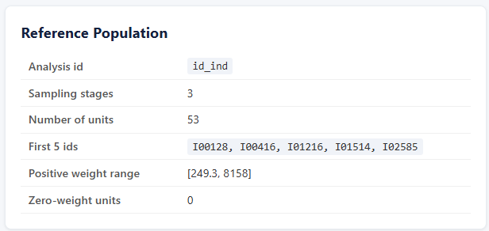
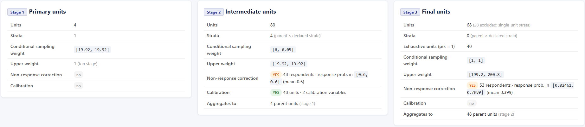
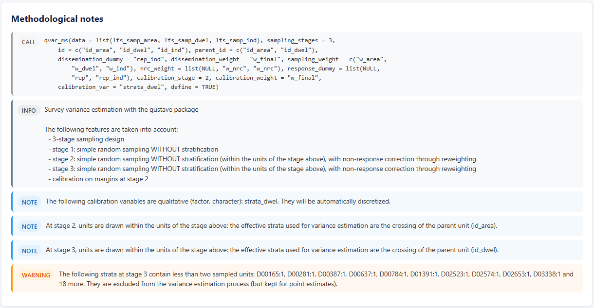
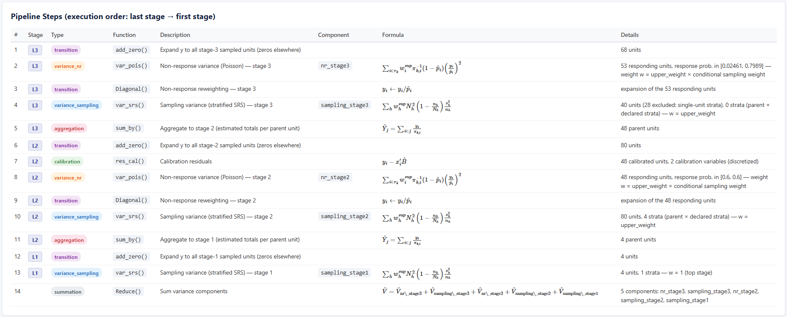
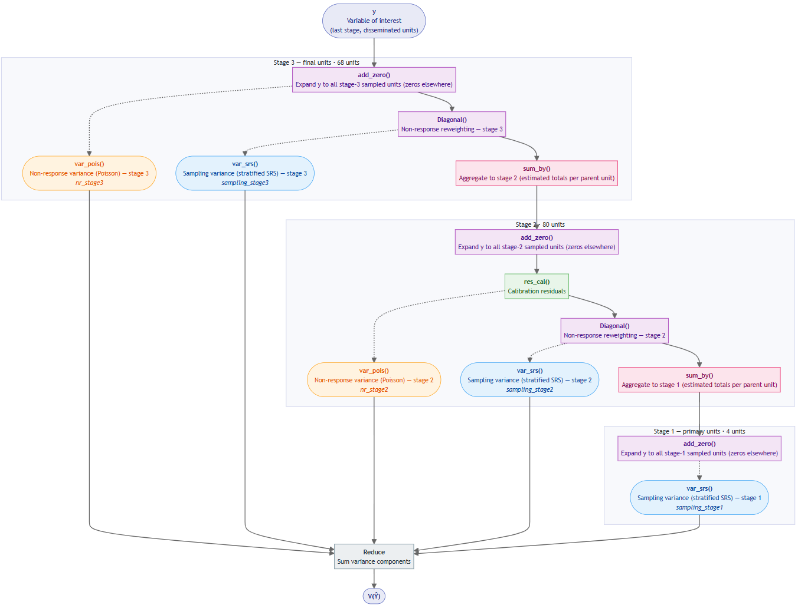
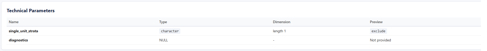
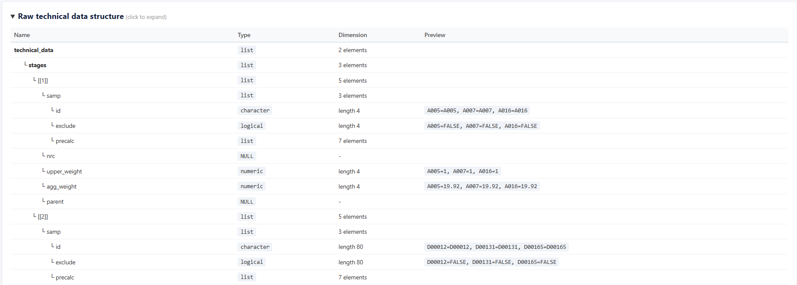

```{r setup, include = FALSE}
knitr::opts_chunk$set(
  collapse = TRUE,
  comment = "#>",
  message = TRUE, 
  warning = TRUE
)
```

# Introduction

The `qvar()` function performs analytical variance estimation in the most
common single-stage case: stratified simple random sampling, non-response
correction through reweighting, calibration on margins. `qvar_ms()` extends
this logic to **multistage designs**: units of stage 2 are drawn within the
units of stage 1, units of stage 3 within the units of stage 2, and so on,
with non-response correction possibly occurring at each stage and
calibration at one given stage.

The variance is estimated as the sum of the conditional variances of each
stage, following the Rao (1975) formula as implemented in the SAS Poulpe
macros (Caron, 1998) and natively supported by the variance functions of the
gustave package: at each stage, the variance contributions (`var_srs()`,
`var_pois()`) are *linearly* weighted by the cumulated corrected weight of
the stages above, through their `w` argument, and the first-stage variance
is computed on the estimated totals per primary sampling unit.

This vignette walks through **nine cases of increasing complexity**, using
the simulated Labour Force Survey (LFS) data shipped with the package
(`lfs_samp_area`: areas, i.e. primary sampling units; `lfs_samp_dwel`:
dwellings sampled within areas; `lfs_samp_ind`: individuals within
dwellings).

```{r libraries, message = FALSE, warning = FALSE}
library(gustave)
library(dplyr)
library(purrr)

lfs_samp_area <- gustave::lfs_samp_area
lfs_samp_dwel <- gustave::lfs_samp_dwel
lfs_samp_ind  <- gustave::lfs_samp_ind
```

# How to use `qvar_ms()`

The best way to learn `qvar_ms()` is to build wrappers of increasing
complexity. This section walks through nine cases, each introducing
exactly one new feature of the interface: from a single-stage design that
reproduces `qvar()` (case 1), through two-stage designs with non-response
correction, stratification and calibration (cases 2 to 6), to three-stage
designs with corrections at several stages and calibration at an
intermediate stage (cases 7 to 9).

The cases are cumulative — the data prepared in one case is reused in the
next — and follow a fixed pattern: the `qvar_ms()` call first, then a
hand-built equivalent using `define_variance_wrapper()` and the core
`gustave` functions, which makes every methodological step explicit and
serves as ground truth. Readers in a hurry can jump to the case matching
their design and work backwards.

`qvar_ms()` uses `varDT()`  to estimate the variance of the estimator of 
a total in the case of a balanced sampling design with equal or unequal 
probabilities using Deville-Tillé (2005) formula. All examples use the 
function `var_srs()`, which is a convenience wrapper for the (stratified) 
simple random sampling case.

## Conventions

Before anything else, the conventions used by `qvar_ms()` — most errors in
practice come from overlooking one of them:

* **Stage ordering.** Stage 1 is the highest sampling stage (e.g. primary
  sampling units); stage `L = sampling_stages` is the final stage (surveyed
  units). `data` is a list of `L` data.frames ordered from stage 1 to stage
  `L`, each containing **all** the units sampled at the corresponding stage,
  including out-of-scope and non-responding units.
* **Parent linkage.** Each file from stage 2 onwards contains a variable
  identifying the unit of the stage above (`parent_id` argument; by default,
  the `id` variable of the previous stage is assumed to be present).
* **Conditional weights.** `sampling_weight` and `nrc_weight` are
  **conditional** weights at the considered stage: the inverse of the
  inclusion (resp. response) probability *given the stages above*. This 
  is the single most important convention of the interface.
* **Response probability.** `response_prob` can be used instead of 
  `nrc_weight` to include response probability at each stage of 
  non-response.
* **Cumulated calibration weight.** `calibration_weight` is the
  **cumulated** weight at the calibration stage — the weight actually used
  in the calibration equations.
* **Last stage only.** `dissemination_dummy`, `dissemination_weight` and
  `scope_dummy` refer to the last stage file.
* **Per-stage arguments.** Non-response correction may be declared at each
  stage through list-valued arguments (`nrc_weight`, `response_dummy`,
  `nrc_dummy`); a single variable name is assigned to the last stage.
  Calibration is declared at one single stage (`calibration_stage`, last
  stage by default).

| Argument               | Per stage?         | Weight convention | Default            |
|------------------------|--------------------|-------------------|--------------------|
| `id`                   | yes (length L)     | —                 | required           |
| `parent_id`            | stages 2..L        | —                 | id of stage above  |
| `sampling_weight`      | yes (length L)     | conditional       | required           |
| `strata`               | yes (list)         | —                 | none               |
| `nrc_weight`, `response_dummy`, `response_dummy`, `nrc_dummy` | yes (list) | conditional | last stage |
| `calibration_stage`    | one stage          | —                 | last stage         |
| `calibration_weight`   | one stage          | **cumulated**     | none               |
| `dissemination_*`, `scope_dummy` | last stage | cumulated        | required / none    |


## Case 1: single stage — backward compatibility with `qvar()`

When `data` is a single data.frame (or `sampling_stages = 1`), `qvar_ms()`
degenerates to the standard single-stage case and should reproduce `qvar()`
exactly. This is the first thing to check.

```{r case1-data}
lfs_samp_dwel$diss    <- TRUE
lfs_samp_dwel$w_dwel  <- 1 / lfs_samp_dwel$pik_dwel
lfs_samp_dwel$w_final <- 1 / lfs_samp_dwel$pik
```

```{r case1}
qvar1 <- qvar_ms(
  data = lfs_samp_dwel,
  id = "id_dwel",
  dissemination_dummy = "diss",
  dissemination_weight = "w_final",
  sampling_weight = "w_final",
  define = TRUE
)

qvar1b <- qvar(
  data = lfs_samp_dwel,
  id = "id_dwel",
  dissemination_dummy = "diss",
  dissemination_weight = "w_final",
  sampling_weight = "w_final",
  define = TRUE
)

qvar1(lfs_samp_dwel, total(income))
qvar1b(lfs_samp_dwel, total(income))
```

Both wrappers return the same estimate and the same variance: with one
stage, the cumulated weight of the "stages above" is 1 everywhere and the
Rao weighting is inactive.

## Case 2: two-stage design, no non-response, no calibration

We now use the area file as a first stage. For this introductory case the
area weights are made equal (no stratification at stage 1), as `qvar_ms()`
— like `qvar()` — relies on the simple random sampling formula within
strata and would otherwise warn and use the mean weight per stratum. The
final dwelling weight is rebuilt as the product of the **conditional**
weights of the two stages.

```{r case2-data}
lfs_samp_area$w_area <- base::mean(1 / lfs_samp_area$pik_area)

lfs_samp_dwel <- lfs_samp_dwel %>%
  left_join(lfs_samp_area %>% select(id_area, w_area), by = "id_area")

lfs_samp_dwel$w_dwel  <- 1 / lfs_samp_dwel$pik_dwel
lfs_samp_dwel$w_final <- lfs_samp_dwel$w_dwel * lfs_samp_dwel$w_area
```

```{r case2}
qvar2 <- qvar_ms(
  # One file per stage, from the highest to the lowest
  data = list(lfs_samp_area, lfs_samp_dwel),
  sampling_stages = 2,
  id = c("id_area", "id_dwel"),
  parent_id = c("id_area"),
  dissemination_dummy = "diss",
  dissemination_weight = "w_final",
  # Conditional sampling weights, one per stage
  sampling_weight = c("w_area", "w_dwel"),
  define = TRUE
)
```

The hand-built equivalent makes the Rao (1975) decomposition explicit:
one within-area variance per primary unit, multiplied by the area weight
(*first power* — this is the Rao row weight), plus the first-stage
variance computed on the estimated area totals. The generalization to more
stages and to non-response phases proceeds recursively, the Rao row weight 
at stage $k$ being the cumulated corrected weight of stages $1, \dots, k-1$. 
This is the estimator implemented by the SAS `Poulpe` macros (Caron, 1998).

```{r case2-benchmark}
var_srs_two <- function(y, smp_area, smp_dwel) {

  variance <- list()
  y <- add_zero(y, rownames = smp_dwel$id_dwel)

  # Stage 2: one SRS variance per area, weighted by the area weight
  variance[["srs-dwel"]] <- unique(smp_dwel$id_area) %>% map(~{
    sub <- smp_dwel %>% filter(id_area == .x)
    w_area <- unique(sub$w_area)
    var_srs(
      y[sub$id_dwel, , drop = FALSE],
      pik = sub$pik_dwel
    ) * w_area
  }) %>% unlist %>% sum

  # Aggregation: estimated totals per area
  y_area <- sum_by(y, by = smp_dwel$id_area, w = 1 / smp_dwel$pik_dwel)

  # Stage 1: SRS variance on the estimated area totals
  variance[["srs-area"]] <- var_srs(
    y_area[smp_area$id_area, , drop = FALSE], 
    pik = 1 / smp_area$w_area
  )

  print(as.data.frame(variance))
  Reduce(`+`, variance)
}

qvar2b <- define_variance_wrapper(
  variance_function = var_srs_two,
  technical_data    = list(smp_area = lfs_samp_area, smp_dwel = lfs_samp_dwel),
  reference_id      = lfs_samp_dwel$id_dwel,
  reference_weight  = lfs_samp_dwel$w_final,
  default_id        = "id_dwel"
)

qvar2(lfs_samp_dwel, total(income))
qvar2b(lfs_samp_dwel, total(income))
```

Note how `qvar_ms()` achieves the per-area computation: at stage 2, the
effective strata are the crossing of the parent unit and of the declared
strata variable (here, none), so that one single stratified `var_srs()`
call is algebraically identical to the sum of per-area variances — the Rao
weight, constant within each area, being passed through the `w` argument.
The components printed by the hand-built version (`srs-dwel`, `srs-area`) correspond one-to-one to the sampling_stage2 and sampling_stage1 components that `qvar_ms()` reports in its "components" diagnostic (see diagnostic 
section below):

```{r}
qvar2(lfs_samp_dwel, total(income), diagnostics = "components")
```


## Case 3: non-response correction at the last stage

We simulate a response mechanism at the dwelling stage. **The non-response
correction weight passed to `qvar_ms()` must be conditional to the current
stage**: `w_nrc = w_dwel / prep`, not `w_final / prep`. Passing a cumulated
weight here is the most common mistake — it silently deflates the response
probabilities computed internally (`sampling_weight / nrc_weight`) and
propagates a spurious factor to every stage of the decomposition. A safer
alternative is to pass the estimated response probabilities directly,
through the `response_prob` argument: probabilities have no cumulated
counterpart, so this mistake simply cannot occur. The two arguments are
mutually exclusive — declare one or the other at each corrected stage, not
both.

```{r case3-data}
set.seed(123)
lfs_samp_dwel$rand  <- runif(nrow(lfs_samp_dwel))
lfs_samp_dwel$rep   <- lfs_samp_dwel$rand <= 0.6
lfs_samp_dwel$prep   <- 0.6
lfs_samp_dwel$w_nrc <- lfs_samp_dwel$w_dwel / lfs_samp_dwel$prep   # conditional!
lfs_samp_dwel$w_final <- lfs_samp_dwel$w_nrc * lfs_samp_dwel$w_area
lfs_samp_dwel$w_final[!lfs_samp_dwel$rep] <- 0
lfs_samp_dwel$income[!lfs_samp_dwel$rep]  <- 0
```

```{r case3}
qvar3 <- qvar_ms(
  data = list(lfs_samp_area, lfs_samp_dwel),
  sampling_stages = 2,
  id = c("id_area", "id_dwel"),
  parent_id = c("id_area"),
  dissemination_dummy = "rep",
  dissemination_weight = "w_final",
  sampling_weight = c("w_area", "w_dwel"),
  # Single names: assigned to the last stage by default
  nrc_weight = "w_nrc",
  # response_prob = "prep", # instead of nrc_weight
  response_dummy = "rep",
  define = TRUE
)
```

In the hand-built version, the non-response variance is a Poisson term
whose Rao row weight is the cumulated design weight down to the current
stage (`w_dwel * w_area`), and the interest variable is expanded by the
inverse response probability before moving up:

```{r case3-benchmark}
var_srs_two <- function(y, smp_area, smp_dwel) {

  variance <- list()
  resp_dwel <- smp_dwel %>% filter(rep == 1)

  # Non-response variance (Poisson, respondents only)
  variance[["nr"]] <- var_pois(
    y[resp_dwel$id_dwel, , drop = FALSE],
    pik = resp_dwel$prep,
    w   = resp_dwel$w_dwel * resp_dwel$w_area
  )

  # Reintroduce non-responding dwellings with zeros
  y <- add_zero(y, rownames = smp_dwel$id_dwel)

  # Stage 2 sampling variance on the NR-expanded variable, over ALL
  # sampled dwellings (non-respondents count as zeros)
  variance[["srs-dwel"]] <- unique(smp_dwel$id_area) %>% map(~{
    sub <- smp_dwel %>% filter(id_area == .x)
    w_area <- unique(sub$w_area)
    var_srs(
      y[sub$id_dwel, , drop = FALSE] / sub$prep,
      pik = sub$pik_dwel
    ) * w_area
  }) %>% unlist %>% sum

  y_area <- sum_by(y / smp_dwel$prep, by = smp_dwel$id_area, w = smp_dwel$w_dwel)

  variance[["srs-area"]] <- var_srs(
    y_area[smp_area$id_area, , drop = FALSE], 
    pik = 1 / smp_area$w_area
  )

  print(as.data.frame(variance))
  Reduce(`+`, variance)
}

qvar3b <- define_variance_wrapper(
  variance_function = var_srs_two,
  technical_data    = list(smp_area = lfs_samp_area, smp_dwel = lfs_samp_dwel),
  reference_id      = lfs_samp_dwel$id_dwel,
  reference_weight  = lfs_samp_dwel$w_final,
  default_id        = "id_dwel"
)

qvar3(lfs_samp_dwel, total(income))
qvar3b(lfs_samp_dwel, total(income))
```

Two things worth noticing. First, the second-stage sampling variance is
computed over **all sampled dwellings**, respondents and non-respondents
alike (the latter with zeros): this is why each stage file must contain all
sampled units. Second, `add_zero()` occurs at the top of each stage block
inside `qvar_ms()`: it does not include non-respondents in the calibration
or non-response steps (those explicitly select their rows), it only
guarantees their presence — with a zero — at the sampling variance step. 
Zeroed non-respondents are not a computational trick but the exact HT 
computation — see the appendix.

## Case 4: stratified first stage with a single-unit stratum

We now stratify the first stage, deliberately putting a single area in
stratum A. Like `qvar()`, `qvar_ms()` warns, excludes such strata from the
variance estimation and keeps them for point estimates. It is also possible 
to estimate variance of single-unit stratum with a Poisson variance term, 
with the argument `single_unit_strata = "poisson"`.

```{r case4-data}
lfs_samp_area$strata <- ifelse(lfs_samp_area$id_area == "A016", "A", "B")
```

```{r case4}
qvar4 <- qvar_ms(
  data = list(lfs_samp_area, lfs_samp_dwel),
  sampling_stages = 2,
  id = c("id_area", "id_dwel"),
  parent_id = c("id_area"),
  dissemination_dummy = "rep",
  dissemination_weight = "w_final",
  sampling_weight = c("w_area", "w_dwel"),
  # One element per stage: strata at stage 1, none at stage 2
  strata = list("strata", NULL),
  nrc_weight = "w_nrc",
  response_dummy = "rep",
  define = TRUE
)
```

The hand-built version has to remove the single-unit strata explicitly
before calling `var_srs()` (which would otherwise stop), reproducing the
behaviour of `qvar_ms()`:

```{r case4-benchmark}
var_srs_two <- function(y, smp_area, smp_dwel) {

  variance <- list()
  resp_dwel <- smp_dwel %>% filter(rep == 1)

  variance[["nr"]] <- var_pois(
    y[resp_dwel$id_dwel, , drop = FALSE],
    pik = resp_dwel$prep,
    w   = resp_dwel$w_dwel * resp_dwel$w_area
  )

  y <- add_zero(y, rownames = smp_dwel$id_dwel)

  variance[["srs-dwel"]] <- unique(smp_dwel$id_area) %>% map(~{
    sub <- smp_dwel %>% filter(id_area == .x)
    w_area <- unique(sub$w_area)
    var_srs(
      y[sub$id_dwel, , drop = FALSE] / sub$prep,
      pik = sub$pik_dwel
    ) * w_area
  }) %>% unlist %>% sum

  y_area <- sum_by(y / smp_dwel$prep, by = smp_dwel$id_area, w = smp_dwel$w_dwel)

  # Exclude single-unit strata (kept for point estimates)
  table_strata <- as.data.frame(table(smp_area$strata))
  single_unit  <- table_strata[which(table_strata$Freq == 1), 1]
  smp_area_ok  <- smp_area %>% filter(!strata %in% single_unit)

  variance[["srs-area"]] <- var_srs(
    y_area[smp_area_ok$id_area, , drop = FALSE],
    pik    = 1 / smp_area_ok$w_area,
    strata = smp_area_ok$strata
  )

  print(as.data.frame(variance))
  Reduce(`+`, variance)
}

qvar4b <- define_variance_wrapper(
  variance_function = var_srs_two,
  technical_data    = list(smp_area = lfs_samp_area, smp_dwel = lfs_samp_dwel),
  reference_id      = lfs_samp_dwel$id_dwel,
  reference_weight  = lfs_samp_dwel$w_final,
  default_id        = "id_dwel"
)

qvar4(lfs_samp_dwel, total(income))
qvar4(lfs_samp_dwel, total(income), single_unit_strata = "poisson")
qvar4b(lfs_samp_dwel, total(income))
```

## Case 5: stratification at both stages

Declared strata at stage 2 or beyond are automatically **crossed with the
parent unit**, since units are drawn within the units of the stage above:
declaring `strata_dwel` at stage 2 means stratified simple random sampling
of dwellings *within each area*. The hand-built version makes this
explicit by passing `strata = sub$strata_dwel` inside each per-area call.

```{r case5-data}
lfs_samp_area$strata_area <- ifelse(lfs_samp_area$id_area == "A016", "A", "B")
lfs_samp_dwel$strata_dwel <- paste0("S",as.numeric(as.factor(lfs_samp_dwel$id_dwel)) %% 3)
```

```{r case5}
qvar5 <- qvar_ms(
  data = list(lfs_samp_area, lfs_samp_dwel),
  sampling_stages = 2,
  id = c("id_area", "id_dwel"),
  parent_id = c("id_area"),
  dissemination_dummy = "rep",
  dissemination_weight = "w_final",
  sampling_weight = c("w_area", "w_dwel"),
  strata = list("strata_area", "strata_dwel"),
  nrc_weight = "w_nrc",
  response_dummy = "rep",
  define = TRUE
)
```

```{r case5-benchmark}
var_srs_two <- function(y, smp_area, smp_dwel) {

  variance <- list()
  resp_dwel <- smp_dwel %>% filter(rep == 1)

  variance[["nr"]] <- var_pois(
    y[resp_dwel$id_dwel, , drop = FALSE],
    pik = resp_dwel$prep,
    w   = resp_dwel$w_dwel * resp_dwel$w_area
  )

  y <- add_zero(y, rownames = smp_dwel$id_dwel)

  # Stage 2: stratified SRS within each area (parent x declared strata)
  variance[["srs-dwel"]] <- unique(smp_dwel$id_area) %>% map(~{
    sub <- smp_dwel %>% filter(id_area == .x)
    w_area <- unique(sub$w_area)
    var_srs(
      y[sub$id_dwel, , drop = FALSE] / sub$prep,
      pik    = sub$pik_dwel,
      strata = sub$strata_dwel
    ) * w_area
  }) %>% unlist %>% sum

  y_area <- sum_by(y / smp_dwel$prep, by = smp_dwel$id_area, w = smp_dwel$w_dwel)

  table_strata <- as.data.frame(table(smp_area$strata_area))
  single_unit  <- table_strata[which(table_strata$Freq == 1), 1]
  smp_area_ok  <- smp_area %>% filter(!strata_area %in% single_unit)

  variance[["srs-area"]] <- var_srs(
    y_area[smp_area_ok$id_area, , drop = FALSE],
    pik    = 1 / smp_area_ok$w_area,
    strata = smp_area_ok$strata_area
  )

  print(as.data.frame(variance))
  Reduce(`+`, variance)
}

qvar5b <- define_variance_wrapper(
  variance_function = var_srs_two,
  technical_data    = list(smp_area = lfs_samp_area, smp_dwel = lfs_samp_dwel),
  reference_id      = lfs_samp_dwel$id_dwel,
  reference_weight  = lfs_samp_dwel$w_final,
  default_id        = "id_dwel"
)

qvar5(lfs_samp_dwel, total(income))
qvar5b(lfs_samp_dwel, total(income))
```

Note that with strata crossed with parent units, single-unit *crossed*
strata (an area containing a single sampled dwelling in a given stratum)
are excluded by default with a warning, just as at stage 1.

## Case 6: calibration at the last stage

Calibration enters the variance estimation through the residual technique
(`res_cal()`): the interest variable is replaced by its residuals on the
calibration variables before the rest of the decomposition. Two conventions
matter here:

* `calibration_weight` is the **cumulated** weight at the calibration stage
  — the weight actually used in the calibration equations (here `w_final`);
* qualitative calibration variables (character or factor) are automatically
  discretized into full sets of dummies. The hand-built version uses
  `model.matrix()` (intercept + treatment contrasts) instead.

```{r case6}
qvar6 <- qvar_ms(
  data = list(lfs_samp_area, lfs_samp_dwel),
  sampling_stages = 2,
  id = c("id_area", "id_dwel"),
  parent_id = c("id_area"),
  dissemination_dummy = "rep",
  dissemination_weight = "w_final",
  sampling_weight = c("w_area", "w_dwel"),
  strata = list("strata_area", NULL),
  nrc_weight = "w_nrc",
  response_dummy = "rep",
  # Calibration at the last stage (default), CUMULATED weight
  calibration_weight = "w_final",
  calibration_var = "strata_dwel",
  define = TRUE
)
```

```{r case6-benchmark}
var_srs_two <- function(y, smp_area, smp_dwel) {

  variance <- list()
  resp_dwel <- smp_dwel %>% filter(rep == 1)

  # Calibration residuals (cumulated weights)
  x_cal <- model.matrix(~ strata_dwel, data = resp_dwel)
  y[resp_dwel$id_dwel, ] <- res_cal(
    y[resp_dwel$id_dwel, ],
    x = x_cal,
    w = resp_dwel$w_final
  )

  variance[["nr"]] <- var_pois(
    y[resp_dwel$id_dwel, , drop = FALSE],
    pik = resp_dwel$prep,
    w   = resp_dwel$w_dwel * resp_dwel$w_area
  )

  y <- add_zero(y, rownames = smp_dwel$id_dwel)

  variance[["srs-dwel"]] <- unique(smp_dwel$id_area) %>% map(~{
    sub <- smp_dwel %>% filter(id_area == .x)
    w_area <- unique(sub$w_area)
    var_srs(
      y[sub$id_dwel, , drop = FALSE] / sub$prep,
      pik = sub$pik_dwel
    ) * w_area
  }) %>% unlist %>% sum

  y_area <- sum_by(y / smp_dwel$prep, by = smp_dwel$id_area, w = smp_dwel$w_dwel)

  table_strata <- as.data.frame(table(smp_area$strata_area))
  single_unit  <- table_strata[which(table_strata$Freq == 1), 1]
  smp_area_ok  <- smp_area %>% filter(!strata_area %in% single_unit)

  variance[["srs-area"]] <- var_srs(
    y_area[smp_area_ok$id_area, , drop = FALSE],
    pik    = 1 / smp_area_ok$w_area,
    strata = smp_area_ok$strata_area
  )

  print(as.data.frame(variance))
  Reduce(`+`, variance)
}

qvar6b <- define_variance_wrapper(
  variance_function = var_srs_two,
  technical_data    = list(smp_area = lfs_samp_area, smp_dwel = lfs_samp_dwel),
  reference_id      = lfs_samp_dwel$id_dwel,
  reference_weight  = lfs_samp_dwel$w_final,
  default_id        = "id_dwel"
)

qvar6(lfs_samp_dwel, total(income))
qvar6b(lfs_samp_dwel, total(income))
```

`qvar_ms()` also compares, at the calibration stage, the calibrated weights
with the cumulated weights guessed from the survey description: their ratio
is the calibration g-weight and should remain close to 1. A systematically
large ratio triggers a warning, and most often reveals that some sampling
or non-response weight is cumulated whereas a conditional weight is
expected (see case 3).

## Case 7: three stages, exhaustive final stage

We add the individual stage. In the LFS design, all individuals of a
responding dwelling are surveyed: the third stage is **exhaustive**
(`pik_ind = 1`). Two consequences: `varDT()` internally discards exhaustive
units (with a note), so the third-stage sampling variance component is
zero; and since the parent stage carries non-response, the individual file
must only contain individuals of **responding** dwellings — `qvar_ms()`
checks that no unit is attached to a non-responding parent.

```{r case7-data}
lfs_samp_ind <- lfs_samp_ind %>%
  left_join(
    lfs_samp_dwel %>% select(id_dwel, rep, pik_dwel, w_dwel, w_final),
    by = "id_dwel"
  ) %>%
  filter(rep) %>%
  mutate(w_ind = 1, pik_ind = 1)

head(lfs_samp_ind)
```

```{r case7}
qvar7 <- qvar_ms(
  data = list(lfs_samp_area, lfs_samp_dwel, lfs_samp_ind),
  sampling_stages = 3,
  id = c("id_area", "id_dwel", "id_ind"),
  parent_id = c("id_area", "id_dwel"),
  dissemination_dummy = "rep",
  dissemination_weight = "w_final",
  sampling_weight = c("w_area", "w_dwel", "w_ind"),
  # List syntax: NR correction at stage 2 only
  nrc_weight = list(NULL, "w_nrc", NULL),
  response_dummy = list(NULL, "rep", NULL),
  define = TRUE
)
```

```{r case7-benchmark}
var_srs_three <- function(y, smp_area, smp_dwel, smp_ind) {

  variance <- list()

  # Stage 3 (individuals): exhaustive, variance contribution is zero
  y <- add_zero(y, rownames = smp_ind$id_ind)
  y_dwel <- sum_by(y, by = smp_ind$id_dwel, w = smp_ind$w_ind)

  # Stage 2 (dwellings): NR + sampling
  resp_dwel <- smp_dwel %>% filter(rep == 1)

  variance[["nr"]] <- var_pois(
    y_dwel[resp_dwel$id_dwel, , drop = FALSE],
    pik = resp_dwel$prep,
    w   = resp_dwel$w_dwel * resp_dwel$w_area
  )

  y_dwel <- add_zero(y_dwel, rownames = smp_dwel$id_dwel)

  variance[["srs-dwel"]] <- unique(smp_dwel$id_area) %>% map(~{
    sub <- smp_dwel %>% filter(id_area == .x)
    w_area <- unique(sub$w_area)
    var_srs(
      y_dwel[sub$id_dwel, , drop = FALSE] / sub$prep,
      pik = sub$pik_dwel
    ) * w_area
  }) %>% unlist %>% sum

  y_area <- sum_by(y_dwel / smp_dwel$prep, by = smp_dwel$id_area, w = smp_dwel$w_dwel)

  # Stage 1 (areas)
  variance[["srs-area"]] <- var_srs(
    y_area[smp_area$id_area, , drop = FALSE],
    pik = 1 / smp_area$w_area
  )

  print(as.data.frame(variance))
  Reduce(`+`, variance)
}

qvar7b <- define_variance_wrapper(
  variance_function = var_srs_three,
  technical_data    = list(smp_area = lfs_samp_area,
                           smp_dwel = lfs_samp_dwel,
                           smp_ind  = lfs_samp_ind),
  reference_id      = lfs_samp_ind$id_ind,
  reference_weight  = lfs_samp_ind$w_final,
  default_id        = "id_ind"
)

qvar7(lfs_samp_ind, total(income))
qvar7b(lfs_samp_ind, total(income))
```

## Case 8: non-response correction at two stages

Non-response may occur at several stages — here, total dwelling
non-response (a whole cluster of individuals is lost) *and* individual
non-response within responding dwellings. The list-valued arguments make
the declaration explicit, one element per stage. Both `w_nrc` weights are,
as always, **conditional** to their stage.

```{r case8-data}
lfs_samp_ind <- gustave::lfs_samp_ind %>%
  left_join(
    lfs_samp_dwel %>% select(id_dwel, rep_hh = rep, pik_dwel,
                             w_nrc_dwel = w_nrc, w_area, w_dwel, w_final),
    by = "id_dwel"
  ) %>%
  filter(rep_hh) %>%
  mutate(w_ind = 1, pik_ind = 1)

set.seed(123)
lfs_samp_ind$rand_ind <- runif(nrow(lfs_samp_ind))
lfs_samp_ind$rep_ind  <- lfs_samp_ind$rand_ind <= 0.8
lfs_samp_ind$prep_ind  <- 0.8
lfs_samp_ind$w_nrc    <- lfs_samp_ind$w_ind / lfs_samp_ind$prep_ind  # conditional!
lfs_samp_ind$w_final  <- lfs_samp_ind$w_area * lfs_samp_ind$w_nrc_dwel * lfs_samp_ind$w_nrc
lfs_samp_ind$w_final[!lfs_samp_ind$rep_ind] <- 0
lfs_samp_ind$income[!lfs_samp_ind$rep_ind]  <- 0
```

```{r case8}
qvar8 <- qvar_ms(
  data = list(lfs_samp_area, lfs_samp_dwel, lfs_samp_ind),
  sampling_stages = 3,
  id = c("id_area", "id_dwel", "id_ind"),
  parent_id = c("id_area", "id_dwel"),
  dissemination_dummy = "rep_ind",
  dissemination_weight = "w_final",
  sampling_weight = c("w_area", "w_dwel", "w_ind"),
  # NR correction at stages 2 and 3
  nrc_weight = list(NULL, "w_nrc", "w_nrc"),
  response_dummy = list(NULL, "rep", "rep_ind"),
  define = TRUE
)
```

Note that the *same variable name* may be used at different stages: each
element of the list is looked up in the data.frame of its own stage
(`w_nrc` in `lfs_samp_dwel` at stage 2, `w_nrc` in `lfs_samp_ind` at
stage 3).

```{r case8-benchmark}
var_srs_three <- function(y, smp_area, smp_dwel, smp_ind) {

  variance <- list()

  # Stage 3 (individuals): NR then (exhaustive) sampling
  resp_ind <- smp_ind %>% filter(rep_ind == 1)

  variance[["nr-ind"]] <- var_pois(
    y[resp_ind$id_ind, , drop = FALSE],
    pik = resp_ind$prep_ind,
    # Rao weight: cumulated design weight down to stage 3
    w   = resp_ind$w_nrc_dwel * resp_ind$w_area * resp_ind$w_ind
  )

  y <- add_zero(y, rownames = smp_ind$id_ind)
  y_dwel <- sum_by(y / smp_ind$prep_ind, by = smp_ind$id_dwel, w = smp_ind$w_ind)

  # Stage 2 (dwellings): NR then sampling
  resp_dwel <- smp_dwel %>% filter(rep == 1)

  variance[["nr"]] <- var_pois(
    y_dwel[resp_dwel$id_dwel, , drop = FALSE],
    pik = resp_dwel$prep,
    w   = resp_dwel$w_dwel * resp_dwel$w_area
  )

  y_dwel <- add_zero(y_dwel, rownames = smp_dwel$id_dwel)

  variance[["srs-dwel"]] <- unique(smp_dwel$id_area) %>% map(~{
    sub <- smp_dwel %>% filter(id_area == .x)
    w_area <- unique(sub$w_area)
    var_srs(
      y_dwel[sub$id_dwel, , drop = FALSE] / sub$prep,
      pik = sub$pik_dwel
    ) * w_area
  }) %>% unlist %>% sum

  y_area <- sum_by(y_dwel / smp_dwel$prep, by = smp_dwel$id_area, w = smp_dwel$w_dwel)

  # Stage 1 (areas)
  variance[["srs-area"]] <- var_srs(
    y_area[smp_area$id_area, , drop = FALSE],
    pik = 1 / smp_area$w_area
  )

  print(as.data.frame(variance))
  Reduce(`+`, variance)
}

qvar8b <- define_variance_wrapper(
  variance_function = var_srs_three,
  technical_data    = list(smp_area = lfs_samp_area,
                           smp_dwel = lfs_samp_dwel,
                           smp_ind  = lfs_samp_ind),
  reference_id      = lfs_samp_ind$id_ind,
  reference_weight  = lfs_samp_ind$w_final,
  default_id        = "id_ind"
)

qvar8(lfs_samp_ind, total(income))
qvar8b(lfs_samp_ind, total(income))
```

The Rao weight of the individual-stage non-response term deserves a pause:
it is the cumulated weight of everything above and including the
individual design stage — `w_area * w_nrc_dwel * w_ind` — where the
dwelling contribution is the *corrected* (post-NR) conditional weight. This
is exactly what `qvar_ms()` builds internally as
`upper_weight * sampling_weight`.

## Case 9: calibration at an intermediate stage

Calibration does not have to occur at the final stage. With
`calibration_stage = 2`, the calibration residuals are computed at the
dwelling stage, on the estimated dwelling totals aggregated from the
individual stage; the stages below the calibration stage are left
unresidualized. This is the first-order (Deville) linearization of the
calibrated estimator: the residual technique applies at the stage of the
units whose weights were calibrated.

```{r case9}
qvar9 <- qvar_ms(
  data = list(lfs_samp_area, lfs_samp_dwel, lfs_samp_ind),
  sampling_stages = 3,
  id = c("id_area", "id_dwel", "id_ind"),
  parent_id = c("id_area", "id_dwel"),
  dissemination_dummy = "rep_ind",
  dissemination_weight = "w_final",
  sampling_weight = c("w_area", "w_dwel", "w_ind"),
  nrc_weight = list(NULL, "w_nrc", "w_nrc"),
  response_dummy = list(NULL, "rep", "rep_ind"),
  # Calibration at stage 2 (dwellings), CUMULATED weight at that stage
  calibration_stage = 2,
  calibration_weight = "w_final",
  calibration_var = "strata_dwel",
  define = TRUE
)
```

```{r case9-benchmark}
var_srs_three <- function(y, smp_area, smp_dwel, smp_ind) {

  variance <- list()

  # Stage 3 (individuals): NR, no residuals here
  resp_ind <- smp_ind %>% filter(rep_ind == 1)

  variance[["nr-ind"]] <- var_pois(
    y[resp_ind$id_ind, , drop = FALSE],
    pik = resp_ind$prep_ind,
    w   = resp_ind$w_nrc_dwel * resp_ind$w_area * resp_ind$w_ind
  )

  y <- add_zero(y, rownames = smp_ind$id_ind)
  y_dwel <- sum_by(y / smp_ind$prep_ind, by = smp_ind$id_dwel, w = smp_ind$w_ind)

  # Stage 2 (dwellings): calibration residuals on the estimated totals,
  # then NR and sampling
  resp_dwel <- smp_dwel %>% filter(rep == 1)

  x_cal <- model.matrix(~ strata_dwel, data = resp_dwel)
  y_dwel[resp_dwel$id_dwel, ] <- res_cal(
    y_dwel[resp_dwel$id_dwel, ],
    x = x_cal,
    w = resp_dwel$w_final
  )

  variance[["nr"]] <- var_pois(
    y_dwel[resp_dwel$id_dwel, , drop = FALSE],
    pik = resp_dwel$prep,
    w   = resp_dwel$w_dwel * resp_dwel$w_area
  )

  y_dwel <- add_zero(y_dwel, rownames = smp_dwel$id_dwel)

  variance[["srs-dwel"]] <- unique(smp_dwel$id_area) %>% map(~{
    sub <- smp_dwel %>% filter(id_area == .x)
    w_area <- unique(sub$w_area)
    var_srs(
      y_dwel[sub$id_dwel, , drop = FALSE] / sub$prep,
      pik = sub$pik_dwel
    ) * w_area
  }) %>% unlist %>% sum

  y_area <- sum_by(y_dwel / smp_dwel$prep, by = smp_dwel$id_area, w = smp_dwel$w_dwel)

  variance[["srs-area"]] <- var_srs(
    y_area[smp_area$id_area, , drop = FALSE],
    pik = 1 / smp_area$w_area
  )

  print(as.data.frame(variance))
  Reduce(`+`, variance)
}

qvar9b <- define_variance_wrapper(
  variance_function = var_srs_three,
  technical_data    = list(smp_area = lfs_samp_area,
                           smp_dwel = lfs_samp_dwel,
                           smp_ind  = lfs_samp_ind),
  reference_id      = lfs_samp_ind$id_ind,
  reference_weight  = lfs_samp_ind$w_final,
  default_id        = "id_ind"
)

qvar9(lfs_samp_ind, total(income))
qvar9b(lfs_samp_ind, total(income))
```

Note that `calibration_weight` refers here to a variable of the *stage 2*
file (`lfs_samp_dwel$w_final`): the cumulated weight at the calibration
stage, i.e. `w_area * w_nrc` at the dwelling stage.

# Estimation diagnostics

Beyond point estimates and confidence intervals, a variance estimation run
carries a wealth of methodological information: where the variance comes
from, what the design costs in precision, whether the confidence intervals
can be trusted, whether the non-response correction is under control.
`qvar_ms()` exposes this information through the `diagnostics` technical
parameter of the variance wrapper.

Because `diagnostics` is a *technical parameter* (see
`define_variance_wrapper()`), it is an argument of the wrapper itself: it
can be switched on for a single estimation, without redefining anything and
at negligible cost, since all precalculated data are shared.

```{r diag-interface, eval = FALSE}
# Nothing by default (batch-friendly)
precision(lfs_samp_dwel, total(income))

# Everything
precision(lfs_samp_dwel, total(income), diagnostics = "all")   # or TRUE

# A subset, with partial matching
precision(lfs_samp_dwel, total(income), diagnostics = c("comp", "deff"))
```

The five available diagnostics are `"components"`, `"deff"`, `"dof"`,
`"nr"` and `"domains"`. Two practical remarks before going through them.
First, diagnostics are printed to the console (standard output) to be used
during interactive work. Second, when several statistics are requested in 
one call, diagnostics are reported per statistic, numbered in the order 
of the call.

The wrappers below are those defined in cases 6 and 9 of this vignette.

## Variance components (`"components"`)

The Rao (1975) decomposition implemented by `qvar_ms()` is additive: the
total variance is the sum of one sampling component per stage
(`sampling_stage1`, `sampling_stage2`, ...) plus one non-response component
per corrected stage (`nr_stage2`, ...), plus, when the Poisson treatment of
single-unit strata is enabled, the corresponding `sampling_pois_stage*`
terms. The `"components"` diagnostic prints this decomposition with the
share of each component in the total:

```{r diag-components}
qvar6(lfs_samp_dwel, total(income), diagnostics = "components")
```

When the wrapper includes a calibration step, the diagnostic automatically
computes the variance of the *uncalibrated* estimator alongside (the
Horvitz-Thompson estimator corrected for non-response), by carrying a
duplicated, non-residualized copy of the linearized variable through the
same single pass. The "effect" column is thus the per-component
effect of calibration. Note: the "without" column is the variance of 
a *different estimator* (with a different point estimate since it 
involves no calibration step).

**Warning signs.**

* *A non-zero calibration effect below the calibration stage.* Components
  of stages strictly below the calibration stage are computed before the
  residualization in the upward loop: they must display exactly `+0.0 %`.
  Anything else indicates a bug or a misdeclared `calibration_stage`.
* *A dominant first-stage component.* When `sampling_stage1` accounts for
  most of the variance, the clustering of the design is the binding
  constraint: increasing the number of final units per PSU will barely
  improve precision (see the `roh` diagnostic below), whereas increasing
  the number of PSUs will.
* *A positive calibration effect on a variable supposedly related to the
  margins.* The variance reduction of calibration is only guaranteed for
  variables that the calibration variables explain. A `+` effect on 
  a target variable of the survey suggests reviewing the choice of margins.

## Design effect (`"deff"`)

The design effect (Kish, 1965) is the ratio of the variance under the
actual design to the variance of the same estimator under a simple random
sample of the same size:

$$\mathrm{deff}(\hat\theta) = \frac{\hat V_{\text{design}}(\hat\theta)}
{\hat V_{\text{SRS}}(\hat\theta)},
\qquad
\mathrm{deft} = \sqrt{\mathrm{deff}},
\qquad
n_{\text{eff}} = n / \mathrm{deff}.$$

The denominator is computed by `var_srs()` with a constant inclusion
probability $n/\hat N$, applied to the *same linearized variable* as the
numerator — so that the design effect is automatically valid for means,
ratios and domain estimates, with the following conventions: $n$ is the
number of disseminated units and $\hat N$ the sum of the full design
weights.

The diagnostic also prints the classical Kish decomposition: the unequal
weighting effect $\mathrm{deff}_w = 1 + \mathrm{CV}^2(w)$ (Kish, 1992),
computed exactly from the weights, and the residual clustering effect
$\mathrm{deff}_c = \mathrm{deff} / \mathrm{deff}_w$, from which the rate of
homogeneity is derived:

$$\mathrm{roh} = \frac{\mathrm{deff}_c - 1}{\bar m - 1},$$

with $\bar m$ the mean number of final units per primary sampling unit.
`roh` estimates the intra-cluster correlation of the study variable and can
be used as an input for designing future waves of the survey.

```{r diag-deff}
qvar6(lfs_samp_dwel, total(income), diagnostics = "deff")
```

**Warning signs.**

* *deff far from 1 on a design that is (nearly) a SRS.* This is the acid
  test of the whole computation: on case 1 of this vignette, the diagnostic
  must print `deff = 1.000` up to rounding. A systematic departure signals
  a weight convention problem, not a design feature.
* *A large weighting effect.* $\mathrm{CV}(w)$ above roughly 1 (i.e.
  $\mathrm{deff}_w > 2$) usually reveals extreme weights — often produced
  by the non-response correction (see the `"nr"` diagnostic) — and calls
  for trimming or coarser reweighting cells.
* *A large roh with a large mean cluster size.* Since
  $\mathrm{deff}_c \approx 1 + (\bar m - 1)\,\mathrm{roh}$, precision is
  bought by more PSUs, not by more units per PSU. Slightly *negative*
  values of roh are possible and benign: they reflect stratification gains
  that the Kish decomposition attributes to the clustering term.
* *Caveat.* The weights used in the decomposition are reconstructed from
  the design and non-response information and ignore the calibration
  g-weights; on strongly calibrated surveys, $\mathrm{deff}_w$ is a slight
  approximation.

## Degrees of freedom (`"dof"`)

Analytical variance estimators for clustered designs behave, to first
order, like variance estimators with

$$\mathrm{df} = (\text{number of PSUs}) - (\text{number of first-stage strata})$$

degrees of freedom. The normal-based confidence intervals produced by 
`gustave` implicitly assume these degrees of freedom to be large. The 
`"dof"` diagnostic prints the rule-of-thumb df and, when it is small, 
the width correction a Student-based interval would apply:

```
-- Degrees of freedom --
  df = 80 PSUs - 2 strata = 78
  Large-sample normal intervals are adequate.
```

versus, in our sample, we only have 4 PSU and no first-stage strata:

```{r diag-dof}
qvar6(lfs_samp_dwel, total(income), diagnostics = "dof")
```

**Warning signs.**

* *df below ~30.* Normal intervals undercover; report t-based intervals or
  at least mention the issue. Below ~10, the variance estimate itself is
  unstable.
* *Domain estimation concentrated in few PSUs.* The nominal df is an upper
  bound: for a domain present in only a handful of PSUs, the effective df
  is closer to the number of PSUs containing the domain. Cross-read with 
  the `"domains"` diagnostic.

## Non-response diagnostics (`"nr"`)

For each stage with a non-response correction, the diagnostic prints the
unweighted and weighted response rates, the distribution of the estimated
response probabilities, and the Kish inflation factor
$1 + \mathrm{CV}^2(1/\hat p)$ applied to the variance by the dispersion of
the non-response weights:

```{r diag-nr}
qvar9(lfs_samp_ind, total(income), diagnostics = "nr")
```

**Warning signs.**

* *Very small minimum response probabilities.* A $\hat p_{\min}$ below
  roughly 0.1 means some units carry a tenfold non-response weight: a
  single such unit can dominate a domain estimate.
* *A gap between unweighted and weighted response rates.* It indicates
  that response propensity is correlated with the design weights — the
  non-response mechanism differs across sampling strata or stages, which is
  worth modelling explicitly (Särndal and Lundström, 2005).
* *An inflation factor well above 1.* The variance cost of reweighting
  itself; combined with a weak relation between the reweighting cells and
  the study variable, it is a net loss. (Little and Vartivarian, 2005)
* At the last stage, the unweighted rate includes out-of-scope units in
  its denominator when a `scope_dummy` is declared; interpret accordingly.

## Domain sample sizes (`"domains"`)

Domain estimation through `by` and `where` is deceptively easy: the
linearized variable is simply zeroed outside the domain, and the machinery
runs unchanged. The `"domains"` diagnostic counts the non-zero
observations behind each requested statistic and flags small domains 
when observations falls below 50:

```{r diag-domains}
qvar6(lfs_samp_dwel,
  "Income, stratum S1" = total(income, where = strata_dwel == "S1"),
  "Income, stratum S2" = total(income, where = strata_dwel == "S2"),
  diagnostics = "domains"
)
```

**Warning signs.**

* *Domains below 50 observations.* Both the estimate and its
  estimated variance are unstable; this is the natural boundary where
  design-based estimation gives way to small area methods.
* *Small domains combined with a low df.* The two previous caveats
  compound: a domain concentrated in a handful of PSUs has both an unstable
  variance and fewer effective degrees of freedom than the nominal rule
  suggests.

## A reading grid

| Symptom | Likely cause | First action |
|---|---|---|
| deff far from 1 under a (near-)SRS design | weight convention error (conditional vs cumulated) | check `"nr"` probabilities and the calibration g-ratio warning |
| dominant `sampling_stage1` component | clustering cost | more PSUs, not more units per PSU; read `roh` |
| calibration effect expected `+0.0 %` but non-zero below the calibration stage | misdeclared `calibration_stage` or bug | check the wrapper with `inspect_wrapper()` |
| large `deff_weights` | extreme weights | inspect `"nr"` minimum probabilities; trim or collapse cells |
| df < 30 | few PSUs | report t-based intervals; consider replication cross-check |
| small-domain flag | thin domain | precision thresholds; small area estimation |

# Inspecting a variance wrapper

A variance wrapper is a peculiar R object: a function that carries, frozen
in its environment and attributes, the complete methodological description
of a survey — identifiers, weights, strata, response probabilities,
calibration data, precalculated matrices. This design is what makes
wrappers so convenient to *use* (one self-contained object, no need to
re-specify the design at each estimation), but it also makes them opaque:
printing the function body tells you nothing about the survey it encodes.

`qvar_notes()` recalls the definition, the notes and the warnings 
emitted when the wrapper was defined. This is often enough to answer the 
most common question about a wrapper someone else defined: *"which features 
does it take into account, and did anything unusual happen at definition 
time?"* — the welcome message, the automatic coercions, the strata crossing 
notes and the single-unit strata warnings are all there.

```{r inspect-print, eval = TRUE}
qvar_notes(qvar9)
```

`inspect_wrapper()` opens the box. Given a wrapper produced by
`qvar_ms()`, it prints a structured console summary and generates an HTML
report describing the reference population, each sampling stage, the
methodological notes, and — most importantly — the exact variance estimation
pipeline that will be executed. It serves three audiences at once:

* **documentation** — the report is a self-contained methodological
  description of the survey, generated from the object itself and
  therefore always in sync with what is actually computed; it can be
  attached to quality reports or handed to a new colleague;
* **audit** — a reviewer can check, without reading any code, that the
  declared design (stages, strata, non-response corrections, calibration
  stage) matches the survey documentation;
* **debugging** — most of the estimation problems discussed in this
  vignette (weight conventions, excluded strata, response probability
  ranges) are visible at a glance in the per-stage cards, *before* any
  estimation is run.

```{r inspect-call, eval = TRUE}
inspect_wrapper(qvar9, plot = FALSE)
```

The function prints a console summary and opens an HTML report in the
browser (use `plot = FALSE` for console-only, or `file =` to choose where
the report is written, e.g. to archive it alongside the survey
documentation).

The HTML report presents the same information in  a series of cards, described
below with their intended screenshots.

## Reference population

```{r inspect-fig-reference, echo = FALSE, out.width = "100%", fig.cap = "Reference population card of the HTML report."}

```

The first card describes the **reference population**: the set of units,
frozen at definition time, on which every estimation will be based — for a
`qvar_ms()` wrapper, the disseminated units of the last sampling stage,
together with their dissemination weights. It is best read as the
*contract* between the wrapper and any estimation file: whatever `data.frame`
is passed at estimation time is matched against these identifiers (extra
rows are discarded, missing units count as zeros, and a differently ordered
file is silently reordered — the warnings discussed earlier in this
vignette all originate from this matching step). The card reports the
analysis identifier (the column the estimation file must contain), the
number of reference units, a preview of the first identifiers and weights,
the range of the positive weights and the number of zero-weight units.

## Per-stage cards

```{r inspect-fig-stages, echo = FALSE, out.width = "100%", fig.cap = "Per-stage cards of the HTML report."}

```

Each stage card summarizes what `qvar_ms()` retained from the declaration:
number of sampled units and excluded units (single-unit strata), number of
effective strata (with the parent-crossing note from stage 2 onwards),
range of the conditional sampling weights and of the cumulated Rao weight,
non-response correction (with the range of the estimated response
probabilities) and calibration. These are computed from the *actual*
technical data of the wrapper, not from the arguments of the call — which
makes them a plausibility check as much as a description. Two examples of
what to look for, both drawn from real debugging sessions:

* **response probabilities outside a plausible range** — a
  `response prob. in [0.07, 0.12]` where the survey documentation says the
  response rate is around 70 % is the signature of a *cumulated*
  non-response weight declared where a *conditional* one is expected (see
  the Conventions section); the estimation would run and silently inflate
  every variance component;
* **an Upper (Rao) weight different from 1 at stage 1**, or a conditional
  weight range at odds with the sampling fractions of the design, points
  to the same family of weight convention errors.

## Methodological notes

```{r inspect-fig-log, echo = FALSE, out.width = "100%", fig.cap = "Methodological notes card: notes and warnings emitted at definition time."}

```

The Methodological notes card replays, colour-coded, everything that was printed
when the wrapper was defined: the definition call itself, the welcome
message (INFO), the automatic coercions and strata-crossing notes (NOTE,
blue), and the warnings (orange) — excluded single-unit strata, unequal
weights replaced by stratum means, suspicious calibration g-ratios.

## Pipeline table and diagram

```{r inspect-fig-pipeline, echo = FALSE, out.width = "100%", fig.cap = "The variance estimation pipeline"}

```

This is the heart of the report. One essential design decision deserves a
word: the pipeline is derived from the **technical data** of the wrapper,
not from the code of the variance function. The code is a static loop with
conditional blocks — `res_cal` and `var_pois` appear in it whether or not
they will run, and `var_srs` appears once although it runs once *per
stage*. What determines the actual execution is the content of
`technical_data`: the inspector therefore rebuilds the pipeline from it,
so that the diagram shows exactly the steps that will execute, stage by
stage — a calibration node only in the calibration stage's subgraph, a
non-response node only at corrected stages, one sampling variance node per
stage.

Each variance node carries the name of its component (`nr_stage2`,
`sampling_stage1`, ...). These names are the same as those printed by the
`diagnostics = "components"` output and stored in the variance list: the
diagram is thus a legend for the numerical decomposition — when a
component dominates, the diagram shows where in the design it comes from.

```{r inspect-fig-diagram, echo = FALSE, out.width = "100%", fig.cap = "The variance estimation diagram"}

```

## Technical parameters and raw technical data

```{r inspect-fig-param, echo = FALSE, out.width = "100%", fig.cap = "Technical parameters."}

```

The technical parameters cards lists the switchable arguments of the
wrapper (`single_unit_strata`, `diagnostics`) with their defaults — the
knobs a user can turn at estimation time without redefining anything. 

```{r inspect-fig-raw, echo = FALSE, out.width = "100%", fig.cap = "Raw technical data."}

```

The last card is a collapsible tree of the raw technical data, descending
recursively into the per-stage lists (identifiers, weights, exclusion
flags, precalculated matrices) with types, dimensions and value previews.
It is the map for advanced users who want to go beyond the report.

Combined with `qvar_notes()` for the methodological notes and the `diagnostics`
technical parameter for estimation-time output, the inspector completes a
three-level tooling: the *log* tells what happened at definition, the
*report* describes what the wrapper is, and the *diagnostics* tell what
each estimation does.

# Conclusion

This vignette started from a simple observation: `qvar()` made analytical
variance estimation accessible for the most common single-stage case, but
the surveys we actually run — and the SAS Poulpe programs we are migrating
from — are multistage. `qvar_ms()` extends the `qvar()` philosophy rather
than replacing it: the same declarative interface (one argument per
methodological feature), the same technical and methodological checks, the
same welcome message, and full backward compatibility, since a single-stage
call reproduces `qvar()` exactly (case 1). What changes is the reach: an
arbitrary number of sampling stages, non-response correction at any subset
of stages (declared through response probabilities or conditional weights),
calibration at any stage, stratification crossed with the parent units, and
a choice of treatments for single-unit strata. The nine cases of this
vignette walked through this space one feature at a time, each validated
against a hand-built `define_variance_wrapper()` benchmark that makes the
underlying Rao (1975) decomposition explicit — the same estimator as the
SAS Poulpe macros, which remain the external reference throughout.

Along the way, the wrapper grew from a computing object into a
methodological one. The `diagnostics` technical parameter allows a 
quality control of the variance estimation procedure — variance components with 
the exact effect of calibration, design effect and its Kish decomposition, 
degrees of freedom, non-response and domain diagnostics — while 
`qvar_notes()` and `inspect_wrapper()` make the wrapper itself readable: 
what happened at definition time, what the encoded design is, and which 
pipeline will actually execute.

More complex multistage cases — unequal probabilities within strata, 
balanced sampling at the first stage, shared or integrated
weights — are to be handled with the core functions of the `gustave`
package, i.e. `define_variance_wrapper()` together with `varDT()`,
`var_pois()` and `res_cal()`, following the patterns of the hand-built
wrappers of this vignette.

Two directions naturally extend this work. The first is external
cross-validation against the `survey` package (Lumley, 2004), the *de facto*
standard of the R ecosystem. Its default estimator for multistage designs
is the ultimate cluster approximation — collapsing all stages into a
with-replacement sampling of primary units — which differs from the
stage-by-stage Rao decomposition implemented here: agreement is expected to
be close but not exact, and the size and sign of the differences (driven by
the first-stage sampling fractions) would be instructive in itself. A
future section comparing `qvar_ms()` wrappers with the corresponding
`svydesign()` objects, including their respective treatments of lonely
PSUs, would give users a second, independent reference point next to
`Poulpe`.

The second direction is downstream integration. A `gustave` wrapper cleanly
separates the design description from the data, which is powerful for
estimation but leaves the pairing of the two to the user. Bundling them
into a design object — in the spirit of `survey::svydesign()`, carrying
the survey file together with its variance wrapper — would allow `gustave`
to plug into the growing ecosystem of tools built on such objects, notably
`fonctionr`, a package developed in Belgium that produces publication-ready
weighted analyses and visualizations from survey design objects. Precision
estimates would then flow directly into graphs and tables, instead of
living in a separate results file. This design-object layer is under
construction and beyond the scope of this vignette.

# Annexe


## One responding unit: the Poisson term as the natural continuation of the SRS formula

Two situations must be distinguished in a stratum. When it contains a
single *sampled* unit, the SRS variance formula is undefined (the $s^2$
term divides by $n - 1 = 0$): this is the case handled by the
`single_unit_strata` treatment. When it contains several sampled units of
which a single one *responds*, the SRS formula remains perfectly defined,
provided the non-responding units are kept in the computation with a zero
value — which is exactly what the `add_zero()` mechanism of `gustave` does.
This appendix shows that, in the latter case, the SRS formula over all $n$
sampled units is **algebraically identical** to the Poisson variance term
of the lone respondent. This identity both explains why strata with a
single respondent require no special treatment, and motivates the Poisson
fallback as the natural continuation of the SRS formula when even the
zeros disappear. Notations follow Chauvet's lecture notes on variance
estimation (Ensai):
<https://ensai.fr/wp-content/uploads/2019/06/TechEchMaster_EstVariance_v1.pdf>

### From the Horvitz-Thompson variance estimator

Under an arbitrary design, the total is estimated by
$$
\hat t_{y\pi} = \sum_{k \in S} \frac{y_k}{\pi_k},
$$
and its variance is estimated (without bias, provided all joint inclusion
probabilities are positive) by
$$
\hat v_{HT}(\hat t_{y\pi}) = \sum_{k,l \in S}
\frac{y_k}{\pi_k} \frac{y_l}{\pi_l}
\frac{\pi_{kl} - \pi_k \pi_l}{\pi_{kl}}.
$$
Suppose a single unit $k$ of the sample carries a non-zero value — say,
one respondent with $y_k = 10$ among four units sampled with
$\pi = 0.25$, the three non-respondents entering with $y = 0$. Every term
of the double sum contains a product $y_k y_l$ and therefore vanishes,
except the diagonal term $k = l$. With the convention
$\pi_{kk} = \pi_k$, the estimator collapses to
$$
\hat v_{HT}(\hat t_{y\pi})
= \left(\frac{y_k}{\pi_k}\right)^2 \frac{\pi_k - \pi_k^2}{\pi_k}
= \left(\frac{y_k}{\pi_k}\right)^2 (1 - \pi_k),
$$
which is precisely the contribution of unit $k$ under a Poisson design —
the term computed by `var_pois()`.

### From the SRS formula with zeroed non-respondents

Under simple random sampling (equal inclusion probabilities
$\pi_k = n/N$), the total is estimated by $\hat t_{y\pi} = N \bar y$ with
$\bar y = \frac{1}{n} \sum_{k \in S} y_k$, and its variance by the
classical formula
$$
\hat v(\hat t_{y\pi}) = N^2 \, \frac{1-f}{n} \, s^2_y,
\qquad
s^2_y = \frac{1}{n-1} \sum_{k \in S} (y_k - \bar y)^2,
\qquad f = \frac{n}{N}.
$$
With a single non-zero unit $k$, the sum of squares splits into the
contribution of the respondent and that of the $n - 1$ zero-valued units,
each equal to $\bar y^2$:
$$
s^2_y = \frac{1}{n-1} \left( (y_k - \bar y)^2 + (n-1)\,\bar y^2 \right)
      = \frac{1}{n-1} \left( y_k^2 - 2 y_k \bar y + n \bar y^2 \right).
$$
Since $\bar y = y_k / n$,
$$
s^2_y = \frac{1}{n-1}
\left( y_k^2 - \frac{2 y_k^2}{n} + \frac{y_k^2}{n} \right)
= \frac{y_k^2}{n-1} \cdot \frac{n-1}{n}
= \frac{y_k^2}{n}.
$$
Injecting into the full formula, with $f = \pi_k = n/N$:
$$
\hat v(\hat t_{y\pi})
= N^2 \, \frac{1 - f}{n} \, \frac{y_k^2}{n}
= \left(1 - \pi_k\right) \frac{N^2 y_k^2}{n^2}
= \left(\frac{y_k}{\pi_k}\right)^2 (1 - \pi_k)
= \hat v_{HT}(\hat t_{y\pi}).
$$

### How to use it in `qvar_ms()` ?

The two computations are rigorously identical: since
the Deville-Tillé formula implemented by `varDT()` reduces exactly to the
classical SRS estimator under equal inclusion probabilities, the identity
holds for the actual `gustave` computation. 
Two consequences for `qvar_ms()`. First, strata
with a single *respondent* among several sampled units require no special
treatment: the SRS formula with zeroed non-respondents already computes
the right quantity. Second, when the stratum contains a single *sampled*
unit, $s^2_y$ is undefined but the diagonal Horvitz-Thompson term
$(1-\pi_k)(y_k/\pi_k)^2$ remains available: this is the term added by
`single_unit_strata = "poisson"`.

# References

* Caron N. (1998), "Le logiciel Poulpe : aspects méthodologiques",
  *Actes des Journées de méthodologie statistique*,
  <http://jms-insee.fr/jms1998s03_1/>
* Chauvet G., Estimation de variance, *Ensai*,
  <https://ensai.fr/wp-content/uploads/2019/06/TechEchMaster_EstVariance_v1.pdf>
* Kish L. (1965), *Survey Sampling*, Wiley.
* Kish L. (1992), "Weighting for unequal P_i", *Journal of Official
  Statistics*, 8(2), 183–200.
* Little R.J.A., Vartivarian S. (2005), "Does weighting for nonresponse
  increase the variance of survey means?", *Survey Methodology*, 31(2),
  161–168.
* Lumley T. (2004), "Analysis of Complex Survey Samples", *Journal of Statistical Software*, 9(8), 1–19.
* Rao J.N.K. (1975), "Unbiased variance estimation for multistage
  designs", *Sankhya*, C n°37, 133–139.
* Särndal C.-E., Lundström S. (2005), *Estimation in Surveys with
  Nonresponse*, Wiley.
* Särndal C.-E., Swensson B., Wretman J. (1992), *Model Assisted Survey
  Sampling*, Springer.
* Wolter K.M. (2007), *Introduction to Variance Estimation*, 2nd ed.,
  Springer.
